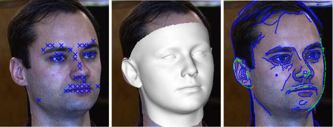
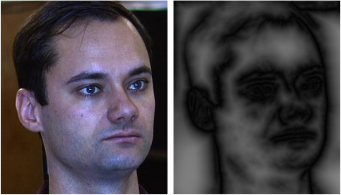
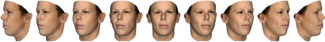
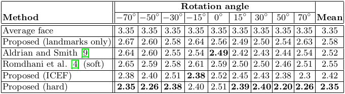
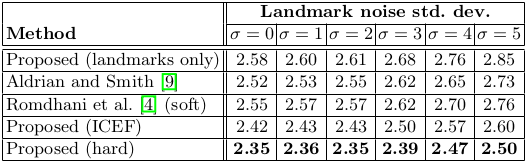
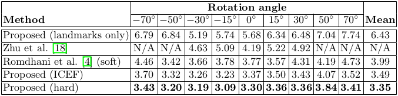
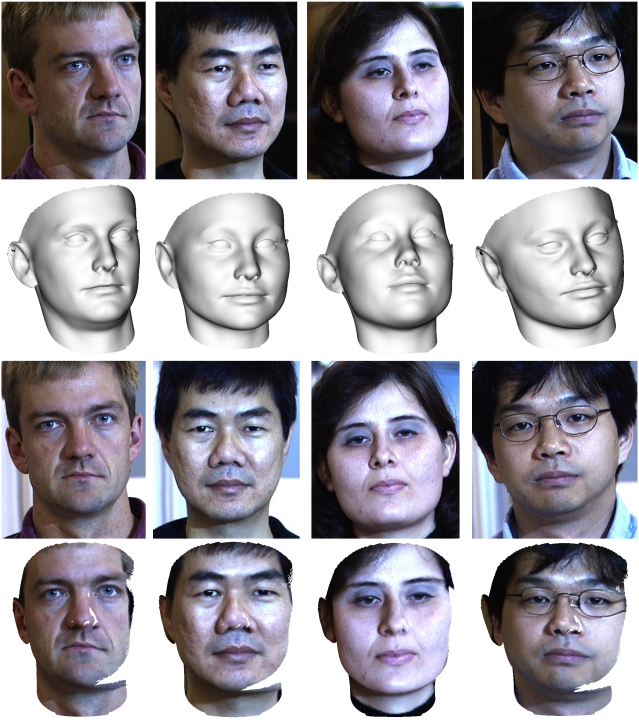
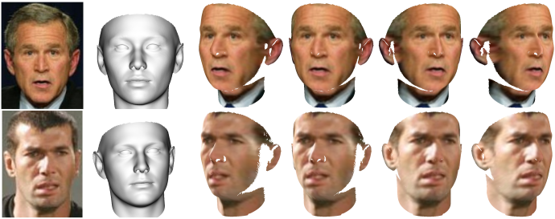

# 拟合三维形变模型到边缘：硬和软对应的比较

> 原标题：
>
> Fitting a 3D Morphable Model to Edges: A Comparison Between Hard and Soft Correspondences

**摘要。**在本文中，我们探讨了仅使用稀疏几何特征（边缘和界标点）将3D形变模型拟合成单人脸图像的问题。此问题的先前方法基于边缘导出成本的非线性优化，可被视为形成模型和图像边缘之间的软对应关系。我们提出了一种新颖的方法，明确计算出难以对应的信件。由此得到的观测函数是非凸的，但我们表明，可以有效地使用交替线性最小二乘法以类似于迭代最近点算法的方式获得良好的初始化。我们在合成和真实图像上展示实验结果，并显示我们的方法优于使用软对应和仅依赖几何特征的其他最新方法的方法。

## 1. 介绍

从一个或多个2D图像估计3D脸部形状是计算机视觉中长期存在的问题。它具有从姿态不变的人脸识别[1]到从2D图像创建3D头像的广泛应用[2]。解决这个问题最成功的方法之一就是使用三维脸形的统计模型[3]。这将形状估计问题转化为模型拟合问题，并在约束问题之前提供强大的统计。

客观的模型可以用不同的方式来表达，最明显的是一种综合分析的方法，其中外观误差是直接优化的[3]。然而，基于特征的方法[4,5]通常更加健壮，并且导致优化问题在局部最小值时不易收敛。在本文中，我们重点研究图像中的边缘特征。

图像边缘传达有关人脸的重要信息。遮挡边界提供有关3D形状的直接信息，例如，配置文件视图显示关于鼻子形状的强大信息。内部边缘，由纹理变化，高曲率或自遮挡引起，提供位置和形状特征的有关信息，如嘴唇，眉毛和鼻子。这些信息提供了从2D图像估计3D人脸形状的线索，或者更一般地说，用于将人脸模型拟合成图像。

在第2节中，我们介绍相关背景。在第3节中，我们提出了一种用已知模型对应关系对地标进行拟合的方法。我们的主要贡献是在第4部分，我们提出了一种新颖的，全自动算法，用于配合硬对应的图像边缘。通过硬对应，我们的意思是在投影模型顶点和边缘像素之间计算明确的对应关系。为了比较，在第5节中，我们描述了我们对以前方法的变体[4,6,7]，它们适用于使用软对应的边缘。通过软对应，我们的意思是捕获许多可能的边缘对应关系的能量项被最小化。最后，我们将实验的两种方法和第6节最近文献中的其他方法进行比较。

### 1.1 相关工作

**标记拟合  **长久以来，地标拟合2D地标一直被用作初始化可变形模型的一种方法[3]。 Breuer等人[8]使用提供全自动系统的界标探测器获得了初始化。最近，地标已被证明足以获得有用的形状估计[9]。此外，可以使用模型对大量检测到的地标进行滤波[10]，并将自动地标检测集成到拟合算法中[11]。与地标相似，局部特征可以用来辅助配合过程[5]。

**边缘融合  **使用图像边缘进行人脸模型拟合的早期实例是主动形状模型（ASM）[12]，其中2D边界模型与图像边缘对齐。在3D中，轮廓直接用于3D人脸形状估计[13]，间接用于拟合3DMM。在这方面最早的工作是由于Moghaddam等人。 [14]谁从3DMM中提取了从多个视图中提取的轮廓。从理论的角度来看，Lüuthi等人[15]探讨了当等高线固定时，面形的限制程度。 Romdhani等人[4]包括边缘距离成本作为混合能量函数的一部分。纹理和外部（轮廓）轮廓以与LM-ICP [16]类似的方式使用，其中图像边缘和模型轮廓之间的对应关系是“柔软的”。这是通过对边缘图像应用距离变换来实现的。这提供了平滑变化的成本表面，其在像素处的值表示距离最近边缘的距离（及其梯度，方向）。 Amberg等人对这个想法进行了扩展。 [6]谁在多视图设置中使用它，并通过平均具有不同参数的结果来平滑边缘距离成本。这样，成本曲面也编码边缘的显着性。 Keller等人[7]表明，这种方法导致成本函数既不连续也不可忽略。这表明优化方法必须慎重选择。

边缘特征也被用于其他方面。 Cashman和Fitzgibbon [17]通过拟合轮廓从2D图像学习3DMM。朱等人[18]提出了一种可以被看作是地标和边缘融合的方法。定义边界的地标在拟合期间被允许在3D人脸表面上滑动。最近一种基于优化方法的替代方法是从提取的人脸轮廓学习到3DMM形状参数[19]。

仅使用几何特征（即地标和边缘）将3DMM拟合到2D图像本质上是非刚性对准问题。令人惊讶的是，采用迭代最近点[20]方法与硬边对应（与ASM拟合类似的方法）的想法在文献[4]中被忽略了。在本文中，我们追求这一想法并开发了一种全自动，简单且高效的迭代3DMM拟合算法（并且我们使得我们的实现可用1）。我们不是在变换的距离边缘空间中工作，而是将对应关系视为“软”，我们计算模型和图像边缘之间的明确对应关系。这允许我们将模型边缘顶点视为具有已知2D位置的界标，为此可以容易地计算出最佳姿态或形状估计。

**现有技术  **最新的面部形状估计方法能够获得比上面的纯粹基于模型的方法高得多的质量结果。他们通过使用以像素为单位的阴影或运动信息来将初始形状估算应用于初始形状估计。例如，Su访janakorn等人。 [21]使用照片集合建立一个个人的平均模型，然后将这个模型加入到视频和细节细节中，这些细节由光流和shape-from-shading添加。曹等人。 [22]采取机器学习的方法，并培训一个回归者，从本地外观预测高分辨率的形状细节。我们在这篇论文中的目的不是直接与这些方法竞争。相反，我们试图了解只使用稀疏的几何信息就可以获得什么质量的重建。我们的方法的输出可以为最先进的改进技术提供更好的初始化，或者不需要建立一个人特定的模型。

## 2. 初步措施

我们的方法是基于在假定缩放字形投影的情况下拟合3DMM来面对图像。因此，我们从引入缩放正射投影和3DMM开始。

### 2.1 缩放正射投影

> SOP: The scaled orthographic, or weak perspective, projection model
>
> 缩放正射影像或弱视角投影模型

缩放正射影像或弱视角投影模型假定相对于从相机到对象的平均距离，对象的深度变化较小。在这个假设下，由$\mathbf{SOP}[\mathbf v, \mathbf R, \mathbf t, s]\in\mathbb R^2​$给出的三维点$\mathbf v=[u\ v\ w]^\mathrm T​$的投影2D位置并不取决于该点距相机的距离，而仅取决于由相机焦距与相机到物体的平均距离之比给出的均匀尺度$s​$：
$$
\mathbf{SOP}[\mathbf v, \mathbf R, \mathbf t, s] = s\left[\begin{matrix}1 & 0 & 0\\0 & 1 & 0\end{matrix}\right]\mathbf{Rv}+s\mathbf t
$$
其中姿态参数$\mathbf R\in\mathbb R^{3\times3}$，$\mathbf t\in\mathbb R^2$和$s\in\mathbb R^+$分别为旋转矩阵，2D平移和刻度。

### 2.2 3D形变模型

3D形变模型是形状由形状参数$\boldsymbol\alpha\in\mathbb R^S$确定的可变形网格。形状通过使用主成分分析（PCA）从数据中学习的线性模型来描述。所以，任何脸部的形状可以近似为：
$$
\mathbf f(\boldsymbol\alpha)=\mathbf P\boldsymbol\alpha+\bar{\mathbf f},
$$

其中$\mathbf P\in\mathbb R^{3N\times S}$包含$S$个主成分，$\bar{\mathbf f}\in\mathbb R^{3N}$是平均形状，矢量$\mathbf f(\boldsymbol\alpha)\in\mathbb R^{3N}$包含$N$个顶点的坐标，堆叠形成一个长矢量：$\mathbf f=\left[u_1\ v_1\ w_1\ ...\ u_N\ v_N\ w_N\right]^\mathrm T$。因此，第$i$个顶点由下式给出：$\mathbf v_i=\left[f_{3i-2}\ f_{3i-1}\ f_{3i}\right]^\mathrm T$。为方便起见，我们将与第$i$个顶点对应的子矩阵表示为$\mathbf P_i\in\mathbb R^{3\times S}$，并将平均人脸形状中对应的顶点表示为$\bar{\mathbf f}_i\in\mathbb R^3$，使得第$i$个顶点由下式给出：$\mathbf v_i=\mathbf P_i\boldsymbol\alpha+\bar{\mathbf f}_i$。同样，我们将与第$i$个顶点的$u$分量相对应的行定义为$\mathbf P_{iu}$（类似于$v$和$w$），并将第$i$个平均形状顶点的$u$分量定义为$\bar f_{iu}$（类似于$v$和$w$）。

## 3. 与已知函数拟合

我们首先展示如何将形变模型拟合成$L$观测到的2D位置$\mathbf x_i=\left[x_i\ y_i\right]^\mathrm T\left(i=1 ... L\right)$，这是由形变模型中相应顶点的投影引起的。我们在第4节讨论如何在实践中获得这些通信。不失一般性，我们假设第二维位置对应于变形模型中的第$i$个顶点。将形变模型拟合到这些观测值的目标是获得形状和姿态参数，以使观察到的和预测的2D位置之间的再现误差$E_{lmk}$最小化：

$$
E_{lmk}(\boldsymbol\alpha,\mathbf R, \mathbf t, s)=\frac1L\sum_{i=1}^L\|\mathbf x_i-\mathbf{SOP}\left[\mathbf P_i\boldsymbol\alpha+\bar{\mathbf f}_i, \mathbf R, \mathbf t, s\right]\|^2.
$$
总和前面的比例因子使得误差的大小与地标的数量不变。这个问题在形状参数和SOP变换矩阵中是多线性的。它也是非线性约束的，因为$\mathbf R$必须是一个有效的旋转矩阵。尽管最小化$E_{lmk}$是一个非凸优化问题，但是使用交替线性最小二乘可以获得良好的初始化，并且随后使用非线性优化来重新定义这个估计。这是我们采取的方法。

### 3.1 姿势估计

我们使用POS算法的简单扩展[23]对$\mathbf R$，$\mathbf t$和$s$进行初始估计。与POS相比，我们另外强制$\mathbf R$是一个有效的旋转矩阵。我们从最小二乘意义上解开一个无约束的系统开始。我们将三个点的两个副本叠加在齐次坐标中，使得$\mathbf A_{2i-1}=\left[u_i\ v_i\ w_i\ 1\ 0\ 0\ 0\ 0\right]$和$\mathbf A_{2i}=\left[0\ 0\ 0\ 0\ u_i\ v_i\ w_i\ 1\right]$并形成相应2D的长矢量点$\mathbf d=\left[x_1\ y_1\ ...\ x_L\ y_L\right]^\mathrm T$。然后用线性最小二乘法求解$\mathbf{Ak}=\mathbf d$中的$\mathbf k\in\mathbb R^8$。我们定义$\mathbf r_1=\left[k_1\ k_2\ k_3\right]$和$\mathbf r_2=\left[k_5\ k_6\ k_7\right]$。比例由$s=\left(\|\mathbf r_1\|+\|\mathbf r_2\|\right)/2$给出，平移矢量由$\mathbf t=\left[k_4/s\ l_8/s\right]^\mathrm T$给出。我们对由$\mathbf r_1$和$\mathbf r_2$形成的矩阵执行奇异值分解：
$$
\mathbf{USV}^\mathrm T=\left[\begin{matrix}\mathbf r_1\\\mathbf r_2\\\mathbf  r_1\times\mathbf r_2\end{matrix}\right]
$$
旋转矩阵由$\mathbf R=\mathbf{UV}^\mathrm T$给出。如果$\det(\mathbf R)=-1$，则我们否定$\mathbf U$的第三行并重新计算$\mathbf R$。这保证了$\mathbf R$是一个有效的旋转矩阵。这种方法给出了一个很好的初始估计，我们随后用$E_{lmk}$关于$\mathbf R$，$\mathbf t$和$s$的非线性优化来进行修正。

### 3.2 形状估计

使用固定姿态估计，缩放正射投影下的形状参数估计是线性问题。作为形状参数的函数的第$i$个顶点的2D位置由下式给出：$s\mathbf R_{1..2}\left(\mathbf P_i\boldsymbol\alpha+\bar{\mathbf f}_i\right)+s\mathbf t$。因此，每个观测顶点将两个方程式添加到线性系统。具体地说，对于每个图像我们形成矩阵$\mathbf C\in\mathbb R^{2L\times S}$其中，
$$
\mathbf C_{2i-1}=s\left(\mathbf R_{11}\mathbf P_{iu}^\mathrm T+\mathbf R_{12}\mathbf P_{iv}^\mathrm T+\mathbf R_{13}\mathbf P_{iw}^\mathrm T\right)
$$
且
$$
\mathbf C_{2i}=s\left(\mathbf R_{21}\mathbf P_{iu}^\mathrm T+\mathbf R_{22}\mathbf P_{iv}^\mathrm T+\mathbf R_{23}\mathbf P_{iw}^\mathrm T\right)
$$
且向量$\mathbf h\in\mathbb R^{2L}$，其中
$$
\mathbf h_{2i-1}=x_i-s\left(\mathbf R_1\bar{\mathbf f}_i+\mathbf t_1\right)\quad\mathrm{and}\quad\mathbf h_{2i}=y_i-s\left(\mathbf R_2\bar{\mathbf f}_i+\mathbf t_2\right)
$$
我们在最小二乘意义上解决$\mathbf C\boldsymbol\alpha=\mathbf h$的附加约束条件，以确保解的合理性。我们关注Brunton等人[24]并在形状参数上使用超箱子约束。这避免了必须选择正则化权重，但通过在形状参数（我们在实验中使用$k=3$）引入线性不等式约束来确保每个参数位于均值的k个标准偏差内。因此，该问题可以作为一个不等式约束线性最小二乘问题以封闭形式解决。

### 3.3 非线性补偿

对固定次数的迭代进行交替的姿态和形状估计，最后我们同时对$\boldsymbol\alpha$，$\mathbf R$，$\mathbf t$和$s$执行$E_{lmk}$的非线性优化。我们在轴角空间中表示$\mathbf R$，以确保它仍然是一个有效的旋转矩阵，并保留$\boldsymbol\alpha$上的超盒限制。我们用Matlab *lsqnonlin*函数中实现的信赖域反射算法[25]来最小化$E_{lmk}$。

## 4. 与硬边对应的拟合

**图1**。边缘配合过程的初始化的迭代最近边缘配合。左：输入图像自动检测地标。中间：通过仅限于地标获得的叠加形状。右图：以蓝色图像边缘，以绿色图像对应的模型边界顶点，以红色显示不可靠对应。

如果地标和模型顶点之间的对应关系已知，则第3节中的方法可使3DMM适用于2D地标位置。例如由遮挡边界引起的边缘不具有与模型顶点的固定对应关系。因此，拟合边缘需要形状和姿态估计与建立图像和模型边缘之间的对应关系。我们提出的方法通过向每个模型边界顶点发现最接近的图像边缘来明确地建立这些对应关系（除了用于去除不可靠匹配的附加滤波以外）。我们的方法包括以下步骤：

1. 检测面部标志
2. 初始化形状并仅通过拟合地标进行姿态估计
3. 使用迭代最近边缘拟合改进初始化
4. 包含地标，边缘和先验项的混合观测函数的非线性优化

我们在本节的其余部分更详细地描述这些步骤中的每一个。

### 4.1 地标

我们使用地标进行初始化，并将其作为整体目标函数的一部分，作为形状估计的一个提示。我们应用适合在“野外”图像上操作的面部标志性检测器。这提供了我们知道形变模型中的对应顶点的面部地标的大概位置。我们使用这些地标位置，通过运行第3部分中的方法仅对这些相应的地标位置进行姿态和形状参数的初始估计。请注意，在此阶段可以使用任何面部标志检测器。在我们的实验中，我们用最近的标志性检测算法[26]显示结果，该算法实现了最先进的性能，并由作者提供了代码。在我们的实验评估中，我们只包括对地标的拟合结果。

### 4.2 边缘损失

我们假设像素的一个子集已被标记为边并存储为集$\mathcal E=\{(x,y)|(x,y)\ \mathrm{is\ an\ edge}\}$。实际上，我们通过对输入图像应用具有固定阈值的Canny边缘检测器来计算边缘。模型轮廓根据B（α，R，t，s）的姿态和形状参数进行计算，定义为位于网格边缘的网格边缘，其相邻的网格边界面对3D面部的遮挡边界。遮挡边界顶点的集合具有可见性的改变。这个定义包括外部（轮廓）和内部（自闭塞）轮廓。由于观察方向与$z$轴对齐，因此只需检查三角形法线$z$分量的符号是否在边的任一侧发生变化即可进行测试。另外，我们检查潜在的边缘顶点没有被网格的另一部分遮挡（使用zbufring），并且我们忽略了位于网格边界上的边缘，因为它们引入了人造边缘。在本文中，我们只处理遮挡轮廓（内部和外部）。如果纹理轮廓被定义在形变模型的表面上，那么在我们的方法中包括这些将是直接的。我们将边缘拟合的目标函数用硬对应定义为每个投影遮挡边界顶点与最近边缘像素之间的平方距离总和：
$$
E_{edge}(\boldsymbol\alpha, \mathbf R, \mathbf t, s)=
\\
\frac1{|\mathcal B\left(\boldsymbol\alpha, \mathbf R, \mathbf t, s\right)|}\sum_{i\in\mathcal B\left(\boldsymbol\alpha, \mathbf R, \mathbf t, s\right)}\min_{\left(x,y\right)\in\mathcal E}\|\left[x\ y\right]^\mathrm T-\mathbf{SOP}\left[\mathbf P_i\boldsymbol\alpha+\bar{\mathbf f}_i,\mathbf R, \mathbf t, s\right]\|^2.
$$
请注意，最小的操作员负责计算硬对应关系。由于一组凸函数的最小值不是凸的，所以这个观测值是非凸的[27]。因此，我们需要一个良好的初始化来确保收敛到接近全局最优的最小值。只适合地标不能提供足够好的初始化。因此，在下一小节中，我们将描述一种方法，用于在第4.5节将边缘成本合并到混合目标函数中之前，获得良好的边缘初始融合。

### 4.3 迭代最近边的拟合

我们建议将具有里程碑意义的装备用最初的装备进行改造，以便以迭代的最近点方式工作。也就是说，对于每个投影模型轮廓顶点，我们找到最接近的图像边缘像素，并将其视为已知的对应关系。结合地标对应关系，我们再次运行第3节中的方法。这会导致更新的姿态和形状参数，并转而更新模型边缘和对应关系。我们迭代这个过程以进行固定次数的迭代。我们将此过程称为迭代最近边拟合（ICEF），并在图1中提供了一个图示。在左侧，我们显示了具有初始界标检测结果的输入图像。在中间，我们展示了通过仅限于地标获得的初始形状和姿势。在右侧，我们以蓝色显示图像边缘像素，并以绿色显示投影模型轮廓（其中最近邻居边缘对应被认为是可靠的）并且以红色（其中对应被认为不可靠）。绿色/蓝色对应用于下一次配合的迭代。

通过将图像边缘像素存储在*kd*树中，可以高效地完成寻找与投影轮廓顶点最接近的图像边缘像素。我们使用两个常用的启发式来对所得到的对应关系进行筛选。首先，我们移除距最近图像边缘像素距离最大的5％匹配。其次，我们删除图像距离除以s的匹配超过阈值（在我们的实验中选为10）。按比例因子s进行划分使得该选择对图像分辨率的变化不变。

### 4.4 之前

在3DMM的训练数据在高维空间形成高斯云的假设下，我们期望每个形状参数遵循具有零均值的正态分布，并且由与相应主分量关联的特征值$\lambda_i$给出的方差。我们发现，包括一个可以捕获这个假设的前期术语能够显着提高单独使用超框约束的性能。事先处罚与平均形状的偏差如下：
$$
E_{prior}(\boldsymbol\alpha)=\sum_{i=1}^S\left(\frac{\alpha_i}{\sqrt{\lambda_i}}\right)^2.
$$

**图2**.从输入图像计算得到的软对应的边缘成本曲面（右）（左）

### 4.5 非线性补偿

最后，我们对包含地标，边缘和先验项的混合观测函数进行非线性优化：
$$
E\left(\boldsymbol\alpha, \mathbf R, \mathbf t, s\right)=w_1E_{lmk}\left(\boldsymbol\alpha, \mathbf R, \mathbf t, s\right)+w_2E_{edge}\left(\boldsymbol\alpha, \mathbf R, \mathbf t, s\right)+w_3E_{prior}\left(\boldsymbol\alpha\right),
$$
其中$w_1$，$w_2$和$w_3$加权每项对整体能量的贡献。地标和边界项对于地标和边缘顶点的数量是不变的，这意味着我们不必调整每个图像的权重（例如，对于表1中的结果，我们使用固定值：$w_1=0.15$，$w_2=0.45$和$w_3=0.4$）。我们保留超盒子约束，所以混合观测值是一个约束非线性最小二乘问题，我们再次使用信赖区域反射算法进行优化。

为了提高效率并避免边缘成本函数的连续性和不可分性问题，我们遵循[6]并保持封闭边界顶点$\mathcal B$固定用于优化器的多次迭代。经过多次迭代后，我们重新计算位于遮挡边界上的顶点并重新启动优化器。

## 5. 软边对应的拟合

**图3**.一个子对象的合成输入图像

**表1**.具有地面真实地标的平均欧几里得顶点距离（毫米）

我们将我们的方法与基于优化边缘成本函数的方法进行了比较，与以前的工作一样[6,7,4]。我们遵循与Amberg等人相同的方法[6]来计算边缘成本函数，但是我们还通过整合比例来进一步提高鲁棒性。对于我们的边缘检测器，我们使用边缘检测器灵敏度阈值$\mathcal T$和尺度$\mathcal S$，我们计算$n = |\mathcal T\times\mathcal S|$梯度幅度阈值非极大值抑制。给定一组边缘图像，$E^1, ..., E^n$，使用每对图像比例和阈值。我们计算欧几里得距离变换$D^1, ..., D^n$，对于每个边缘图像（即，$D^i$中的每个像素的值是到$E^i$中最近边缘像素的距离）。最后，我们计算边缘成本曲面为：
$$
S(x,y)=\frac1n\sum_{i=1}^n\frac{D^i(x,y)}{D^i(x,y)+\kappa}
$$
参数$\kappa$以自适应方式确定边缘的影响范围。 Amberg等人[6]建议$\kappa$值为头部的预期大小的$1/20$（以像素为单位）。我们根据比例$s$自动计算这个参数。图2显示了边缘代价曲面的一个例子。为了评估边缘成本，我们按照第2节计算模型轮廓顶点，并使用双线性插值对边缘成本函数进行插值：
$$
E_{softedge}(\boldsymbol\alpha, \mathbf R, \mathbf t, s) = \frac1{|\mathcal B(\boldsymbol\alpha, \mathbf R, \mathbf t, s)|}\sum_{i\in\mathcal B(\boldsymbol\alpha, \mathbf R, \mathbf t, s)}S(\mathbf{SOP}\,\left[\mathbf P_i\boldsymbol\alpha+\bar{\mathbf f}_i, \mathbf R, \mathbf t, s\right]).
$$
与硬边成本一样，我们发现最佳性能是通过将混合目标函数中的地标和先验项包括在内来实现的。因此，我们尽量减少：
$$
E(\boldsymbol\alpha, \mathbf R, \mathbf t, s)=w_1E_{lmk}(\boldsymbol\alpha, \mathbf R, \mathbf t, s)+w_2E_{softedge}(\boldsymbol\alpha, \mathbf R, \mathbf t, s)+w_3E_{prior}(\boldsymbol\alpha).
$$
我们再次仅使用4.1节中的方法对地标进行初始化，保留超盒约束并使用信赖域反射算法进行优化。我们在实验中使用与硬对应方法相同的权重。

## 6. 实验结果

我们提出两组实验结果。首先，我们使用具有已知基本真实3D形状的合成图像来定量评估我们的方法并提供与以前工作的比较。其次，我们使用真实图像为我们的方法在非受控条件下的性能提供定性证据。对于这两组实验中的3DMM，我们使用巴塞尔人脸模型[28]。

**表2**.具有嘈杂地标的平均欧几里德顶点距离（毫米）

**表3**.具有自动检测的界标的平均欧几里德顶点距离（毫米）

### 6.1 定量评估

我们从合成数据的定量比较评估开始。我们使用巴塞尔人脸模型提供的10个样本外面，并以9个姿势（围绕垂直方向旋转0°，±15°，±30°，±50°和±70°）呈现每个人脸的正交图像轴）。我们在图3中显示了一个子对象的样本输入图像。在所有的实验中，我们报告了在Procrustes对齐之后，以毫米为单位的地面真实和估计的面部表面之间的平均欧几里得距离。

在第一个实验中，我们使用了地面真实的地标。具体而言，我们使用70 Farkas地标，将可见子集投影到图像上（每个图像产生37到65个地标）并绕到最近的像素。在表1中，我们显示了在姿态角和整个数据集上的平均结果。作为基线，如果我们简单地使用平均脸形，我们将显示错误。然后我们将结果的结果仅显示在地标上，即第3节中的方法。我们包括两种比较方法。 Aldrian和Smith [9]的方法只使用了地标，但是使用了一个有效的相机模型和一个学习模型的地标方差。 Romdhani等人的软边对应方法[4]在第5节中描述。最后两行显示了我们提出的方法的两种变体：快速迭代最近边拟合版本和完全版本，其中非线性优化了硬通信成本。整个数据集的平均性能对我们的方法来说是最好的，并且通常只使用地标上的边缘，并且应用非线性优化可以提高性能。我们的方法在仅有地标的方法上的性能改进随着姿态角度而改善。这表明边缘信息对于非正面姿势更为显着。

**图4**.定性的正化结果

第二个实验与第一个实验相同，不同之处在于我们将具有不同标准差的高斯噪声添加到地面真实地标位置。在表2中，我们显示了所有姿势和主题的平均结果。

在最后的实验中，我们使用可以使用Zhu和Ramanan [26]的方法自动检测的地标。这使我们能够与朱等人最近的拟合算法进行比较。 [18]。我们使用作者自己的实现，它只能与固定的68个地标集合一起使用。这意味着该方法不能应用于检测到较少地标的更极端的姿态角。在这种更具挑战性的情况下，我们的方法再次提供了最佳的整体性能，并且对于所有姿态角度都是优越的

**图5**.定性姿势编辑结果

### 6.2 定性评估

在图4中，我们展示了来自CMU PIE [29]数据集的定性示例。在这里，我们使用自动检测到的地标在非正面姿势下拍摄图像（第一行）[26]，并在第二行显示重建。我们将图像纹理映射到网格上，旋转到正面姿势（底部行）并与实际正面视图（第三行）进行比较。最后，我们从图5中的野生数据集[30]中的Labeled Faces中展示定性示例。我们再次将纹理映射到网格并显示一系列姿势。这些结果表明我们的方法能够完全自动地适应无约束的图像。

## 7. 结论

我们提出了一种全自动算法，用于将3DMM融合到使用硬边对应的单个图像，并将其与使用软对应的现有方法进行比较。在3D-3D对齐中，LM-ICP [16]的软对应比硬ICP [20]更明显。然而，在3D-2D非刚性对齐的情况下，由于等高线在参数变化下出现，消失，分裂和合并[7]，所以软边缘成本函数既不连续也不可微分。这使得它的优化具有挑战性，不稳定并且高度依赖于仔细选择优化参数。虽然我们提出的算法依赖于潜在的脆性硬对应，但分别求解形状和姿态只需求解线性问题，并且一起优化多线性问题。这使得迭代最接近边缘的速度非常快，并且它提供了一个初始化，允许随后的非线性优化收敛到更好的最佳状态。我们认为这解释了通过软对应改善边缘贴合性能。

这项工作有很多方法可以延长。首先，我们可以探索制定软通信概念的其他方式。例如，我们可以从SoftPOSIT [31]或Blind PnP [32]中借用，它们都可以估计未知3D-2D对应的姿态。其次，我们可以将任何改进都纳入标准ICP [33]。第三，我们目前只使用几何信息而不适合纹理。最后，我们希望将该方法扩展到使用捕获表达式变化并纳入时间平滑约束的模型的视频。

## 参考文献

1. Blanz, V., Vetter, T.: Face recognition based on fitting a 3D morphable model. IEEE Trans. Pattern Anal. Mach. Intell. 25 (2003) 1063–1074
2. Ichim, A.E., Bouaziz, S., Pauly, M.: Dynamic 3D avatar creation from hand-held video input. ACM Trans. Graph. 34 (2015) 45
3. Blanz, V., Vetter, T.: A morphable model for the synthesis of 3D faces. In: SIGGRAPH. (1999)
4. Romdhani, S., Vetter, T.: Estimating 3D shape and texture using pixel intensity, edges, specular highlights, texture constraints and a prior. In: CVPR. (2005)
5. Huber, P., Feng, Z., Christmas, W., Kittler, J., Rätsch, M.: Fitting 3D morphable models using local features. In: ICIP. (2015)
6. Amberg, B., Blake, A., Fitzgibbon, A., Romdhani, S., Vetter, T.: Reconstructing high quality face-surfaces using model based stereo. In: ICCV. (2007)
7. Keller, M., Knothe, R., Vetter, T.: 3D reconstruction of human faces from occluding contours. In: MIRAGE. (2007)
8. Breuer, P., Kim, K., Kienzle, W., Schölkopf, B., Blanz, V.: Automatic 3D face reconstruction from single images or video. In: Proc. FG. (2008) 1–8
9. Aldrian, O., Smith, W.A.P.: Inverse rendering of faces with a 3D morphable model. IEEE Trans. Pattern Anal. Mach. Intell. 35 (2013) 1080–1093
10. Amberg, B., Vetter, T.: Optimal landmark detection using shape models and branch and bound. In: Proc. ICCV. (2011)
11. Schönborn, S., Forster, A., Egger, B., Vetter, T.: A monte carlo strategy to integrate detection and model-based face analysis. Patt. Rec. (2013) 101–110
12. Cootes, T.F., Taylor, C.J., Cooper, D., Graham, J.: Active shape models – their training and application. Comput. Vis. Image Underst. 61 (1995) 38–59
13. Atkinson, G.A., Smith, M.L., Smith, L.N., Farooq, A.R.: Facial geometry estimation using photometric stereo and profile views. In: Proc. ICB. (2009)
14. Moghaddam, B., Lee, J., Pfister, H., Machiraju, R.: Model-based 3D face capture with shape-from-silhouettes. In: Proc. FG. (2003)
15. Lüthi, M., Albrecht, T., Vetter, T.: Probabilistic modeling and visualization of the flexibility in morphable models. In: Math. of Surf. XIII. (2009)
16. Fitzgibbon, A.W.: Robust registration of 2D and 3D point sets. Image Vis. Comput. 21 (2003) 1145–1153
17. Cashman, T.J., Fitzgibbon, A.W.: What shape are dolphins? Building 3D morphable models from 2d images. IEEE Trans. Pattern Anal. Mach. Intell. 35 (2013) 232–244
18. Zhu, X., Lei, Z., Yan, J., Yi, D., Li, S.Z.: High-fidelity pose and expression normalization for face recognition in the wild. In: Proc. CVPR. (2015) 787–796
19. Sánchez-Escobedo, D., Castelán, M., Smith, W.: Statistical 3D face shape estimation from occluding contours. Comput. Vis. Image Underst. 142 (2016)
20. Besl, P.J., McKay, N.D.: A method for registration of 3-D shapes. IEEE Trans. Pattern Anal. Mach. Intell. 14 (1992) 239—256
21. Suwajanakorn, S., Kemelmacher-Shlizerman, I., Seitz, S.M.: Total moving face reconstruction. In: ECCV. (2014)
22. Cao, C., Bradley, D., Zhou, K., Beeler, T.: Real-time high-fidelity facial performance capture. ACM Trans. Graph. 34 (2015) 46
23. Dementhon, D.F., Davis, L.S.: Model-based object pose in 25 lines of code. Int. J. Comput. Vis. 15 (1995) 123–141
24. Brunton, A., Salazar, A., Bolkart, T., Wuhrer, S.: Review of statistical shape spaces for 3D data with comparative analysis for human faces. Comput. Vis. Image Underst. 128 (2014) 1–17
25. Coleman, T., Li, Y.: An interior, trust region approach for nonlinear minimization subject to bounds. SIAM J. Optimiz. 6 (1996) 418–445
26. Zhu, X., Ramanan, D.: Face detection, pose estimation, and landmark localization in the wild. In: Proc. CVPR. (2012)
27. Grant, M., Boyd, S., Ye, Y.: Disciplined convex programming. In: Global Optimization: From Theory to Implementation. Springer (2006) 155–210
28. Paysan, P., Knothe, R., Amberg, B., Romdhani, S., Vetter, T.: A 3D face model for pose and illumination invariant face recognition. In: Proc. AVSS. (2009)
29. Sim, T., Baker, S., Bsat, M.: The CMU pose, illumination, and expression database. IEEE Trans. Pattern Anal. Mach. Intell. 25 (2003) 1615–1618
30. Huang, G.B., Ramesh, M., Berg, T., Learned-Miller, E.: Labeled faces in the wild: A database for studying face recognition in unconstrained environments. Technical Report 07-49, University of Massachusetts, Amherst (2007)
31. David, P., DeMenthon, D., Duraiswami, R., Samet, H.: SoftPOSIT: Simultaneous pose and correspondence determination. In: Proc. ECCV. (2002) 698–714
32. Moreno-Noguer, F., Lepetit, V., Fua, P.: Pose priors for simultaneously solving alignment and correspondence. In: Proc. ECCV. (2008) 405–418
33. Rusinkiewicz, S., Levoy, M.: Efficient variants of the ICP algorithm. In: Proc. 3DIM. (2001)

