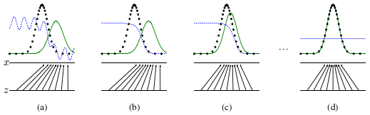
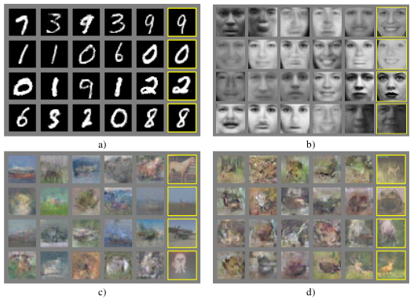
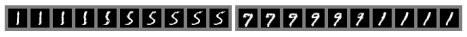

# 生成对抗网络

$$
\mathbf{
Ian J.\ Goodfellow,\ Jean\ Pouget-Abadie^*, Mehdi\ Mirza,\ Bing\ Xu,\ David\ Warde-Farley, 
\\
Sherjil\ Ozair^\dagger,\ Aaron\ Courville,\ Yoshua\ Bengio^\ddagger
}
\\
\mathrm{
Département\ d’informatique\ et\ de\ recherche\ opérationnelle
\\
Université\ de\ Montréal
\\
Montréal,\ QC\ H3C\ 3J7
}
$$

$\mathrm{^*Jean\ Pouget-Abadie\ is\ visiting\ Université\ de\ Montréal\ from\ Ecole\ Polytechnique.}$
$^\dagger\mathrm{Sherjil\ Ozair\ is\ visiting\ Université\ de\ Montréal\ from\ Indian\ Institute\ of\ Technology\ Delhi}$
$\mathrm{^\ddagger\ Yoshua\ Bengio\ is\ a\ CIFAR\ Senior\ Fellow.}$


## 摘要

我们提出了一个通过对抗过程来估计生成模型的新框架，其中我们同时训练两个模型：捕获数据分布的生成模型$G$和估计样本来自训练数据的概率的判别模型$D$。$G$的训练程序是最大化$D$犯错误的概率。该框架对应于minimax双人博弈。在任意函数$G$和$D$的空间中，存在唯一的解决方案，其中$G$恢复训练数据分布并且$D$无论如何都等于$\frac12$。在$G$和$D$由多层感知器定义的情况下，整个系统可以用反向传播进行训练。在训练或生成样本期间不需要任何马尔可夫链或展开的近似推断网络。实验通过对生成的样品进行定性和定量评估来证明该框架的潜力。

## 1. 介绍

深度学习的前景是发现丰富的层次模型[2]，它代表人工智能应用中遇到的各种数据的概率分布，如自然图像，包含语音的音频波形和自然语言语料库中的符号。到目前为止，深度学习中最引人注目的成功涉及辨别模型，通常是那些将高维度，丰富的感官输入映射到类标签的模型[14, 22]。这些惊人的成功主要基于反向传播和丢失算法，使用分段线性单元[19, 9, 10]，它们具有特别良好的梯度。深度生成模型的影响较小，因为近似于最大似然估计和相关策略中出现的许多难以处理的概率计算，并且由于在生成环境中利用分段线性单元的好处是困难的。我们提出了一种新的生成模型估计程序，可以回避这些困难。[^1]

在拟议的对抗性网络框架中，生成模型与对手进行对比：一种判别模型，用于确定样本是来自模型分布还是数据分布。生成模型可以被认为类似于造假者团队，试图生产虚假货币并在没有检测的情况下使用它，而歧视模型类似于警察，试图检测伪造货币。在这个游戏中的竞争促使两个团队改进他们的方法，直到假冒伪劣品与真品无法区分。

该框架可以为多种模型和优化算法提供特定的训练算法。在本文中，我们探讨了生成模型通过多层感知器传递随机噪声生成样本的特殊情况，并且判别模型也是多层感知器。我们将这种特殊情况称为对抗性网络。在这种情况下，我们可以仅使用非常成功的反向传播和丢失算法[17]来训练两个模型，并且仅使用前向传播来生成来自生成模型的样本。不需要近似推理或马尔可夫链。

## 2. 相关工作

具有潜在变量的定向图形模型的替代方案是具有潜变量的无向图形模型，例如受限制的玻尔兹曼机器（RBM）[27, 16]，深玻尔兹曼机器（DBM）[26]及其众多变体。这些模型中的相互作用表示为非标准化势函数的乘积，通过随机变量的所有状态的全局求和/积分来归一化。这个数量（分区函数）及其梯度对于除了最平凡的实例之外的所有实例都是难以处理的，尽管它们可以通过马尔可夫链蒙特卡罗（MCMC）方法来估计。混合对于依赖MCMC的学习算法提出了一个重要的问题[3, 5]。

深度置信网络（DBN）[16]是包含单个无向层和若干有向层的混合模型。虽然存在快速近似分层训练标准，但DBN会产生与无向和定向模型相关的计算差异。

还提出了不接近或约束对数似然的替代标准，例如得分匹配[18]和噪声对比估计（NCE）[13]。这两者都要求学习概率密度在分析上特定于标准化常数。请注意，在许多具有多层潜在变量（例如DBN和DBM）的有趣生成模型中，甚至不可能得出易处理的非标准化概率密度。某些模型（如去噪自动编码器[30]和收缩自动编码器）的学习规则与应用于RBM的分数匹配非常相似。在NCE中，正如在这项工作中，采用歧视性训练标准来“生成”一个生成模型。然而，生成模型本身不是用于单独的判别模型，而是用于区分生成的数据和样本的噪声分布。因为NCE使用了一个“ ャ”的噪声分布，所以在模型在一小部分观察变量上学习了大致正确的分布后，学习速度会急剧下降。

最后，一些技术不涉及明确地定义概率分布，而是训练生成机器从所需分布中抽取样本。这种方法的优点是可以将这种机器设计成通过反向传播进行训练。最近在该领域的突出工作包括生成随机网络（GSN）框架[5]，该框架扩展了广义去噪自动编码器[4]：两者都可以看作是参数化马尔可夫链，即一个人学习执行生成马尔可夫链的一步的机器的参数。与GSN相比，对抗性网络框架不需要马尔可夫链进行采样。因为对抗网在生成期间不需要反馈回路，所以它们能够更好地利用分段线性单元[19,9,10]，这提高了反向传播的性能，但是当在反馈回路中使用时存在无界激活的问题。最近通过反向传播训练生成机器的例子包括最近关于变分贝叶斯[20]和随机反向传播[24]的自动编码工作。

## 3. 对抗网络

当模型是多层感知器时，对抗建模框架最直接应用。为了在数据$\mathbf x$上学习生成器的分布$p_g$，我们在输入噪声变量$p_z(\mathbf z)$上定义先验，然后将数据空间的映射表示为$G(\mathrm z;\theta_g)$，其中$G$是由多层感知器表示的可微函数参数为$\theta_g$。 我们还定义了第二个多层感知器$D(\mathbf x;\theta_d)$，它输出单个标量。$D(\mathbf x)$表示$\mathbf x$来自数据而不是$p_g$的概率。 我们训练$D$以最大化为训练样本和来自$G$的样本分配正确标签的概率。我们同时训练$G$以最小化$\log(1-D(G(\mathbf z)))$：

换句话说，$D$和$G$使用值函数$V(G, D)$进行以下双人迷你极小博弈：
$$
\min_G\max_DV(D,G)=\mathbb E_{\mathbf x\sim p_{data}(\mathbf x)}[\log D(\mathbf x)]+\mathbb E_{\mathbf x\sim p_{data}(\mathbf x)}[\log(1-D(G(\mathbf z)))]\tag{1}
$$
在下一节中，我们提出了对抗网络的理论分析，基本上表明训练标准允许人们恢复数据生成分布，因为$G$和$D$被赋予足够的容量，即在非参数限制中。有关该方法的不太正式，更具教学意义的解释，请参见图1。在实践中，我们必须使用迭代的数值方法来实现游戏。在训练的内循环中优化$D$到完成在计算上是禁止的，并且在有限数据集上将导致过度拟合。相反，我们在优化$D$的$k$个步骤和优化$G$的一个步骤之间交替。这导致$D$保持接近其最优解，只要$G$变化足够慢。这种策略类似于SML/PCD [31, 29]训练将马尔可夫链中的样本从一个学习步骤维持到下一个学习步骤的方式，以避免作为学习内循环的一部分在马尔可夫链中燃烧。该过程在算法1中正式呈现。

在实践中，等式1可能无法为G学习提供足够的梯度。在学习初期，当$G$很差时，$D$可以拒绝具有高置信度的样本，因为它们与训练数据明显不同。在这种情况下，$\log(1-D(G(\mathbf z)))$饱和。我们可以训练$G$以最大化$\log D(G(\mathbf z))$，而不是训练$G$以最小化$\log(1-D(G(z)))$。该目标函数导致$G$和$D$动力学的相同固定点，但在学习早期提供更强的梯度。



图1：生成对抗网络通过同时更新判别分布（$D$，蓝色，虚线）进行训练，以便区分来自数据生成分布（黑色，虚线）$p_\mathbf x$的样本与生成分布$p_g(G)$的样本（绿色，实线）。下面的水平线是从中采样$\mathbf z$的域，在这种情况下是均匀的。上面的水平线是$\mathbf x$域的一部分。向上箭头表示映射$\mathbf x=G(z)$如何在变换样本上施加非均匀分布$p_g$。$G$在高密度区域收缩，在低密度区域扩展。（a）考虑靠近收敛的对抗对：$p_g$类似于$p_{data}$，$D$是部分准确的分类。（b）在算法$D$的内环中训练以区分样本和数据，收敛到$D^*(x)=\frac{p_{data}(\mathbf x)}{p_{data}(\mathbf x)+p_g(\mathbf x)}$。 （c）在更新$G$之后，$D$的梯度引导$G(\mathbf z)$流向更可能被分类为数据的区域。 （d）经过几个步骤的训练后，如果$G$和$D$有足够的容量，它们将达到两个都无法改善的点，因为$p_g=p_{data}$。鉴别器不能区分两个分布，即$D(\mathbf x)=\frac12$。

## 4. 理论结果 

生成器$G$隐含地将概率分布$p_g$定义为当$\mathbf z\sim p_\mathbf z$时获得的样本$G(\mathbf z)$的分布。因此，如果给定足够的容量和训练时间，我们希望算法1收敛到$p_{data}$的良好估计。本部分的结果是在非参数设置中完成的，例如我们通过研究概率密度函数空间中的收敛来表示具有有限容量的模型。

我们将在4.1节中说明这个minimax游戏对于$p_g=p_{data}$具有全局最优。然后我们将在4.2节中展示算法1优化等式1，从而获得所需的结果。

---

**算法1** Minibatch生成对抗网的随机梯度下降训练。应用于鉴别器的步骤数$k$是超参数。我们在实验中使用了$k=1$，这是最便宜的选择。

---

$\mathrm{\quad\mathbf{for}\ number\ of\ training\ iterations\ \mathbf{do}}$

$\quad\quad\mathbf{for}\ k\ \mathrm{steps}\ \mathbf{do}$

$\quad\quad\quad\mathrm{\bullet\ Sample\ minibatch\ of\ }m\ \mathrm{noise\ examples}\ \{\mathbf z^{(1)}, ..., \mathbf z^{(m)}\}\ \mathrm{from\ noise\ prior}\ p_g(\mathbf z).$

$\quad\quad\quad\bullet\ \mathrm{Sample\ minibatch\ of}\ m\ \mathrm{examples}\ \{\mathbf x^{(1)}, ..., \mathbf x^{(m)}\}\ \mathrm{from\ data\ generating\ distribution}\ p_{data}(\mathbf x).$

$\quad\quad\quad\bullet\ \mathrm{Update\ the\ discriminator\ by\ ascending\ its\ stochastic\ gradient:}$
$$
\nabla_{\theta_d}\frac1m\sum_{i=1}^m\left[\log D\left(\mathbf x^{(i)}\right)+\log\left(1-D\left(G\left(\mathbf z^{(i)}\right)\right)\right)\right].
$$
$\quad\quad\mathbf{end\ for}$

$\quad\quad\bullet\ \mathrm{Sample\ minibatch\ of}\ m\ \mathrm{noise\ samples}\ \{\mathbf z^{(1)}, ..., \mathbf z^{(n)}\}\ \mathrm{from\ noise\ prior\ }p_g(\mathbf z).$

$\quad\quad\bullet\ \mathrm{Update\ the\ generator\ by\ descending\ its\ stochastic\ gradient:}$
$$
\nabla_{\theta_g}\frac1m\sum_{i=1}^m\log\left(1-D\left(G\left(\mathbf z^{(i)}\right)\right)\right).
$$
$\quad\mathbf{end\ for}$

$\quad\mathrm{The\ gradient-based\ updates\ can\ use\ any\ standard\ gradient-based\ learning\ rule. \ We\ used\ momen-\\\quad tun\ in\ out\ experiments.}$

---

### 4.1 $p_g=p_{data}$的全局最优性

我们首先考虑任何给定发生器G的最佳鉴别器D。

**命题1**. 对于特定的$G$，最优鉴别器$D$是
$$
D_G^*(\mathbf x)=\frac{p_{data}(\mathbf x)}{p_{data}(\mathbf x)+p_g(\mathbf x)}\tag2
$$
*证明*. 鉴于任何生成器$G$，鉴别器$D$的训练标准是最大化量$V(G, D)$
$$
\begin{align}
V(G, D) =& \int_xp_{data}(\mathbf x)\log(D(\mathbf x))\mathrm dx+\int_zp_z(\mathbf z)\log(1-D(g(\mathbf z)))\mathrm dz
\\
=&\int_xp_{data}(\mathbf x)\log(D(\mathbf x))+p_g(\mathbf x)\log(1-D(x))\mathrm dx
\end{align}
$$
对于任何$(a, b)\in\mathbb R^2$ \ $\{0, 0\}$，函数$y\rightarrow a\log(y)+b\log(1-y)$在$[0, 1]$中使$\frac a{a+b}$达到其最大值。鉴别器不需要在$\sup p(p_{data})\bigcup\sup p(p_g)$之外定义，结论证明。

注意，$D$的训练目标可以解释为最大化用于估计条件概率$P(Y=y\mid x)$的对数似然，其中$Y$表示$x$是来自$p_{data}$（$y=1$）还是来自$p_g$（$y=0$）。方程式中的极小极大游戏1现在可以重新表述为：
$$
\begin{align}
C(G)=&\max_DV(G,D)
\\
=&\mathbb E_{x\sim p_{data}}[\log D_G^*(\mathbf x)]+\mathbb E_{x\sim p_x}[\log(1-D_G^*(G(\mathbf z)))]\tag4
\\
=&\mathbb E_{x\sim p_{data}}[\log D_G^*(\mathbf x)]+\mathbb E_{x\sim p_x}[\log(1-D_G^*(\mathbf x))]
\\
=&\mathbb E_{x\sim p_{data}}\left[\log\frac{p_{data}(\mathbf x)}{p_{data}(\mathbf x)+p_g(\mathbf x)}\right]+\mathbb E_{x\sim p_g}\left[\log\frac{p_g(\mathbf x)}{p_{data}(\mathbf x)+p_g(\mathbf x)}\right]
\end{align}
$$
**定理1**. *当且仅当$p_g=p_{data}$时，实现虚拟训练标准$C(G)$的全局最小值。此时，$C(G)$达到了值  - $\log4$。*

*证明*. 对于$p_g=p_{data}$，$D_G^*(\mathbf x)=\frac12$，（考虑等式2）。因此，通过检查等式4在$D_G^*(\mathbf x)=\frac12$，我们发现$C(G)=\log\frac12+\log\frac12=-\log4$。为了确认这是$C(G)$的最佳可能值，仅当$p_g=p_{data}$，观察到
$$
\mathbb E_{\mathbf x\sim p_{data}}[-\log2]+\mathbb E_{\mathbf x\sim p_g}[-\log2]=-\log4
$$
通过从$C(G)=V(D_G^*, G)$中减去该表达式，我们得到：
$$
C(G)=-\log(4)+KL\left(p_{data}\|\frac{p_{data}+p_g}2\right)+KL\left(p_g\|\frac{p_{data}+p_g}2\right)\tag5
$$
其中KL是Kullback-Leibler分歧。我们在前面的表达式中认识到模型分布和数据生成过程之间的Jensen-Shannon差异：
$$
C(G)=-\log(4)+2\cdot JSD(p_{data}\|p_g)\tag6
$$
由于两个分布之间的Jensen-Shannon分歧总是非负的，只有当它们相等时才为零，我们已经证明$C^*=-\log(4)$是$C(G)$的全局最小值，唯一的解是$p_g=p_{data}$，即完全复制数据生成过程的生成模型。

### 4.2 算法1的收敛性

**命题2**. *如果$G$和$D$具有足够的容量，并且在算法1的每一步，允许鉴别器达到其最佳给定$G$，并且更新$p_g$以便改进标准*
$$
\mathbb E_{x\sim p_{data}}[\log D_G^*(\mathbf x)]+\mathbb E_{x\sim p_g}[\log(1-D_G^*(\mathbf x))]
$$
*然后$p_g$收敛到$p_{data}$*

*证明*. 考虑$V(G, D) = U(p_g, D)$作为$p_g$的函数，如在上述标准中所做的那样。注意，$U(p_g, D)$在$p_g$中是凸的。凸函数的上界的子衍生物包括在达到最大值的点处函数的导数。换句话说，如果$f(x)=\sup_{\alpha\in A}f_\alpha(x)$和$f_\alpha(x)$对于每个$\alpha$在$x$中是凸的，如果$\beta=\arg\sup_{\alpha\in}f_\alpha(x)$则为$\partial f_\beta(x)\in\partial f$。这相当于在最佳$D$处计算$p_g$的梯度下降更新，给定相应的$G$。$\sup_DU(p_g, D)$在$p_g$中是凸的，具有在Thm 1.中证明的唯一全局最优，因此具有足够小的$p_g$更新，$p_g$汇总到$p_x$，得出结论证明。

在实践中，对抗网络通过函数$G(z; θ_g)$表示有限的$p_g$分布族，并且我们优化$\theta_g$而不是$p_g$本身。 使用多层感知器来定义$G$在参数空间中引入了多个关键点。 然而，多层感知器在实践中的优异性能表明它们是一种合理的模型，尽管它们缺乏理论上的保证。

## 5. 实验

我们训练了对抗网络的一系列数据集，包括MNIST [23]，多伦多人脸数据库（TFD）[28]和CIFAR-10 [21]。发电机网使用了整体线性激活[19,9]和S形激活的混合，而鉴别器网使用了maxout [10]激活。辍学[17]用于训练鉴别网。虽然我们的理论框架允许在发电机的中间层使用压差和其他噪声，但我们使用噪声作为发电机网络最底层的输入。

我们通过将高斯Parzen窗口设置为用$G$生成的样本并在此分布下报告对数似然来估计测试集数据在$p_g$下的概率。 $\sigma$参数通过验证集上的交叉验证获得高斯算子。该程序在Breuleux等人的文章中介绍。 [8]并用于各种生成模型，其确切的可能性是不易处理的[25,3,5]。结果报告在表1中。这种估计可能性的方法具有稍高的方差，并且在高维空间中表现不佳，但它是我们所知的最佳方法。可以采样但不能估计可能性的生成模型的进步直接激发了对如何评估此类模型的进一步研究。

|      Model       |    MNIST    |     TFD     |
| :--------------: | :---------: | :---------: |
|     DBN [3]      |  $138\pm2$  | $1909\pm66$ |
| Stacked CAE [3]  | $121\pm1.6$ | $2110\pm50$ |
|   Deep GSN [6]   | $214\pm1.1$ | $1890\pm29$ |
| Adversarial nets |  $225\pm2$  | $2057\pm26$ |

表1：Parzen基于窗口的对数似然估计。在MNIST上报告的数字是测试集上样本的平均对数似然，并且在示例中计算平均值的标准误差。在TFD上，我们计算了数据集折叠的标准误差，使用每个折叠的验证集选择不同的$\sigma$。在TFD上，$\sigma$在每个折叠上交叉验证，并计算每个折叠的平均对数似然。对于MNIST，我们将与其他数据集的实值（而不是二进制）版本进行比较。

在图2和图3中，我们显示了训练后从生成网络中抽取的样本。虽然我们没有声称这些样本比现有方法生成的样本更好，但我们认为这些样本至少与文献中更好的生成模型竞争，并突出了对抗框架的潜力。



图2：来自模型的样本的可视化。最右边的列显示最近的相邻样本的训练示例，以证明模型没有记住训练集。样品是公平的随机抽取，而不是挑选。与深度生成模型的大多数其他可视化不同，这些图像显示来自模型分布的实际样本，而不是给定隐藏单元样本的条件均值。而且，这些样品是不相关的，因为取样过程不依赖于马尔可夫链混合。 a）MNIST b）TFD c）CIFAR-10（完全连接模型）d）CIFAR-10（卷积鉴别器和“反卷积”发生器）



图3：通过在完整模型的z空间中的坐标之间线性插值获得的数字。

|            |         深度有向图模型         |               深度无向图模型                |             生成自动编码器             |               对抗模型               |
| :--------: | :----------------------------: | :-----------------------------------------: | :------------------------------------: | :----------------------------------: |
|    训练    |        培训期间需要推断        | 培训期间需要推断。 MCMC需要近似分区函数梯度 | 在混合和重建生成的力量之间进行强制权衡 |     使鉴别器与发生器同步。黑体。     |
|    推理    |          得知近似推论          |                  变分推断                   |             基于MCMC的推理             |             得知近似推论             |
|    采样    |            没有困难            |               需要马尔可夫链                |             需要马尔可夫链             |               没有困难               |
| 评估$p(x)$ |    难以处理，可以用AIS近似     |           难以处理，可以用AIS近似           |  未明确表示，可以用Parzen密度估计近似  | 未明确表示，可以用Parzen密度估计近似 |
|  模型设计  | 几乎所有模型都会遇到极大的困难 |         需要精心设计以确保多种属性          |       理论上允许任何可微分的函数       |      理论上允许任何可微分的函数      |

## 6. 优点和缺点

与以前的建模框架相比，这个新框架具有优缺点。缺点主要在于没有$p_g(x)$的明确表示，并且$D$在训练期间必须与$G$很好地同步（特别是，在不更新$D$的情况下，$G$不得过多训练，以避免“Helvetica场景” “其中$G$将太多的$z$值折叠到$x$的相同值以具有足够的多样性来模拟$p_{data}$”，就像Boltzmann机器的负链必须在学习步骤之间保持最新一样。优点是永远不需要马尔可夫链，只有backprop用于获得渐变，学习期间不需要推理，并且可以将多种功能合并到模型中。表2总结了生成性对抗网与其他生成建模方法的比较。

上述优点主要是计算的。对抗模型也可以从发电机网络获得一些统计优势，而不是直接用数据示例更新，而是仅通过鉴别器得到梯度。这意味着输入的组件不会直接复制到生成器的参数中。对抗性网络的另一个优点是它们可以表示非常尖锐，甚至简并的分布，而基于马尔可夫链的方法要求分布有些模糊，以便链能够在模式之间混合。

## 7. 结论及未来工作

该框架承认了许多简单的扩展：

1. 条件生成模型$p(x\mid c)$可以通过添加$c$作为$G$和$D$的输入来获得。
2. 可以通过训练辅助网络来预测给定$x$的$z$来进行学习的近似推断。 这类似于由唤醒-睡眠算法[15]训练的推理网，但具有以下优点：在发电机网完成训练之后，可以针对固定的发电机网训练推理网。
3. 可以近似地模拟所有条件$p(x_S\mid x_\cancel S)$，其中$S$是$x$的索引的子集，通过训练共享参数的一族条件模型。从本质上讲，人们可以使用对抗网来实现确定性MP-DBM的随机扩展[11]。
4. 半监督学习：当有限的标记数据可用时，鉴别器或推理网的特征可以提高分类器的性能。
5. 提高效率：通过划分更好的协调$G$和$D$的方法或确定在训练期间更好地分配样本$z$，可以大大加快培训。

本文证明了对抗性建模框架的可行性，表明这些研究方向可能有用。

## 致谢

我们要感谢Patrice Marcotte，Olivier Delalleau，Kyunghyun Cho，Guillaume Alain和Jason Yosinski的有益讨论。 Yann Dauphin与我们分享了他的Parzen窗口评估代码。 我们要感谢Pylearn2 [12]和Theano [7, 1]的开发人员，尤其是Frédéric Bastien，他特意推出了Theano功能以使该项目受益。 Arnaud Bergeron为$\rm{\LaTeX}$排版提供了急需的支持。 我们还要感谢CIFAR和加拿大研究主席的资助，以及Compute Canada和Calcul Québec提供的计算资源。 Ian Goodfellow得到2013年谷歌深度学习奖学金的支持。 最后，我们要感谢Les Trois Brasseurs激发我们的创造力。

## 参考文献

略。


[^1]: All code and hyperparameters available at http://www.github.com/goodfeli/adversarial


## 附录

### BibTeX

```BibTex
@article{Goodfellow2014Generative,
  title={Generative Adversarial Networks},
  author={Goodfellow, Ian J and Pouget-Abadie, Jean and Mirza, Mehdi and Xu, Bing and Warde-Farley, David and Ozair, Sherjil and Courville, Aaron and Bengio, Yoshua},
  journal={Advances in Neural Information Processing Systems},
  volume={3},
  pages={2672-2680},
  year={2014},
}
```

### 乱七八糟

```latex
\rm{L\!\!^A\!T\!_{\large E}}\!X
\rm{\LaTeX}
```

发现的一些小东西。$\rm{L\!\!^A\!T\!_{\large E}}\!X$，$\rm{\LaTeX}$。前者是自己写的，后者是内置的。看起来很好玩的样子。

