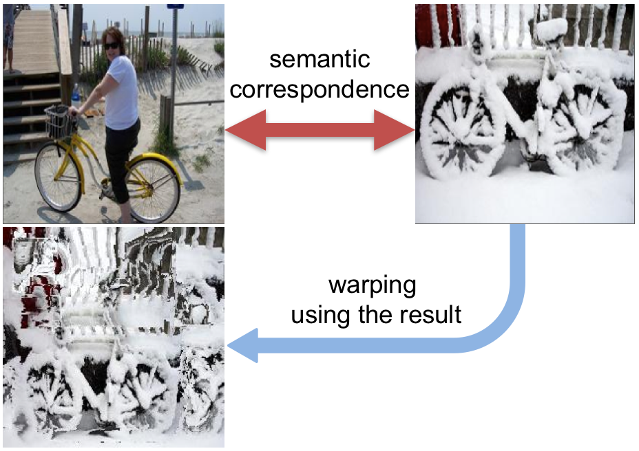
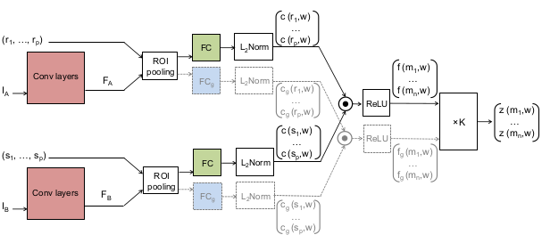
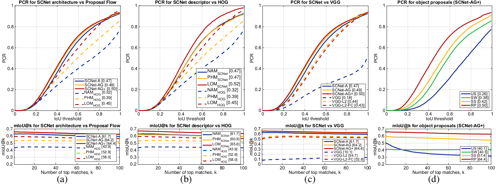
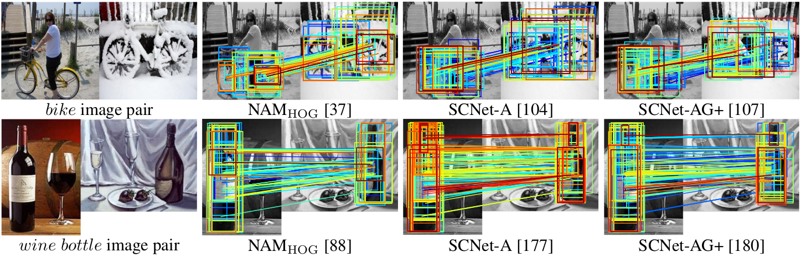
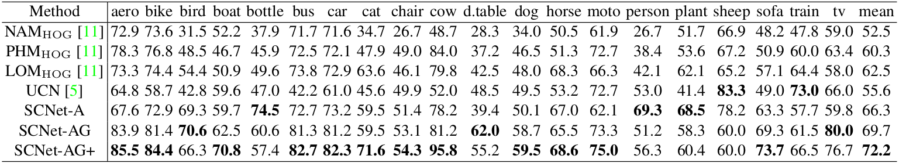
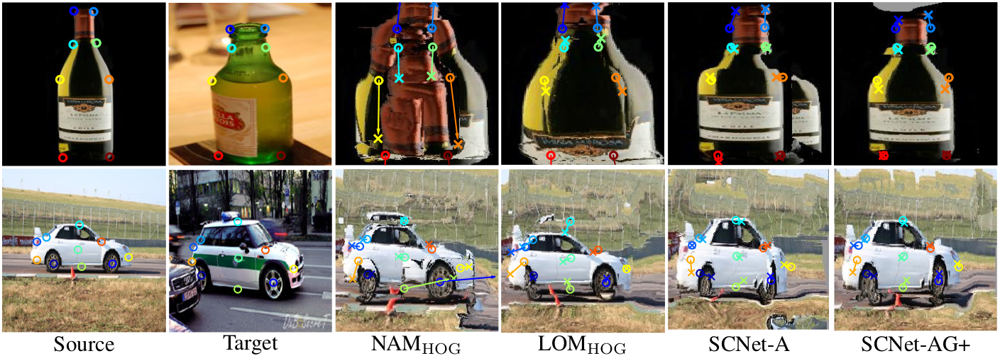
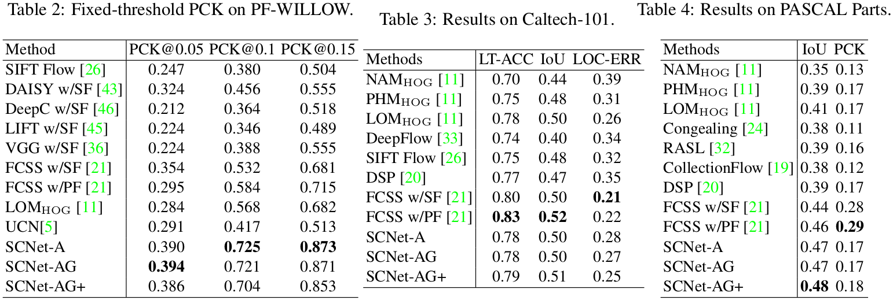

# SCNet: 学习语义对应

>  原标题: SCNet: Learning Semantic Correspondence

$$
\mathrm{
Kai\ Han^1\qquad Rafael\ S. Rezende^{4,5}\qquad Bumsub\ Ham^2\qquad Kwan\text-Yee\ K. Wong^1
\\
Minsu\ Cho^3\qquad Cordelia\ Schmid^{4,∗}\qquad Jean\ Ponce^{5,4}
}
$$

$$
\mathrm{
^1The\ University\ of\ Hong\ Kong\qquad^2Yonsei\ Univ.\qquad^3POSTECH\qquad^4Inria
\\
^5Department\ of\ Computer\ Science,\ ENS\,/\,CNRS\,/\,PSL\ Research\ University
}
$$

## 摘要

*本文讨论了在描绘同一对象或场景类别的不同实例的图像之间建立语义对应关系的问题。 先前的方法着重于将空间正规化器与手工制作的特征相结合，或者仅为外观学习对应模型。 我们提出了一种卷积神经网络结构，称为SCNet，用于学习语义对应的几何可信模型。 SCNet使用区域提议作为匹配基元，并明确地将几何一致性纳入其损失函数中。 它是通过从PASCAL VOC 2007关键点数据集中获得的图像对进行培训的，对几个标准基准的比较评估表明，所提出的方法远远优于近期深度学习架构和基于手工特征的以前方法。*

## 1. 介绍

图1：学习语义对应。我们提出了一种卷积神经网络SCNet，使用外观和几何学来学习语义对应。这使我们能够处理很大程度的课堂和场景变化。该图通过我们的方法使用其语义对应来显示一对输入图像（顶部）和变形图像（底部）。（最好用彩色查看。）

我们在本文中的目标是在包含同一对象或场景类别的不同实例的图像之间建立*语义对应关系*，并因此在外观和空间布局方面比在*立体视觉*中使用的相同场景的图像具有更大的变化，这里广泛地不仅包括经典（窄基线）立体融合（例如，[[31][31], [34][34]]），还包括光流计算（例如[[15][15],[33][33],[42][42]]）和宽基线匹配（例如[[30](),[43]()]）。由于如此大的变化，语义对应的问题仍然非常具有挑战性。大多数先前的语义对应方法[[2](),[17](),[20](),[26](),[37](),[43]()]集中于将有效的空间正规化器与手工特征相结合，例如 SIFT [[28]()]，DAISY [[39]()]或HOG [[6]()]。随着视觉识别中深度学习方法的显着成功，几种基于学习的方法也被提出用于立体视觉[[9](),[12](),[47](),[48]()]和语义对应[[5](),[21](),[50]()]。然而，这些方法都没有利用几何一致性约束，这些约束已被证明是手工制作对手成功的关键因素。几何正则化（如果有的话）在后处理期间发生，但在学习期间不发生（例如，[[47](),[48]()]）。在本文中，我们提出了一种卷积神经网络（CNN）架构，称为*SCNet*，用于学习几何上合理的语义对应（图1）。遵循Ham等人的语义对应的*proposal flow*方法。[[11]()]，我们使用对象提议[[29](),[40](),[51]()]作为匹配基元，并明确地将这些提议的几何一致性纳入我们的损失函数中。然而，与其具有手工特征的[[11]()]不同，我们使用从PASCAL VOC 2007关键点数据集中提取的图像对以端对端的方式训练我们的系统[[7]()]。对几个标准基准的比较评估表明，所提出的方法明显优于最近的深度架构和基于手工特性的以前的方法。

## 2. 相关工作

这里我们简要描述与语义对应相关的代表性方法。

**语义对应。**SIFT Flow [[26]()]扩展了经典的光流以建立类似但不同场景的对应关系。它使用密集的SIFT描述符来捕获超出朴素颜色值的语义信息，并利用从粗到细的流水线中的分级优化技术来提高效率。 Kim等人[[20]()]和Hur等人。[[17]()]提出了更有效的SIFT流的概括。杨等人不使用SIFT特征，[[43]()]使用DAISY [[39]()]进行有效的描述符提取。受到典型-LDA方法的启发[[13]()]，Bristow等人[[2]()]使用白化的SIFT描述符，使语义对应对背景混乱具有鲁棒性。最近，Ham等人[[11]()]介绍了提议流程，使用对象提议作为语义对应的匹配元素，以适应规模和混乱。这项工作表明，HOG描述符比深度学习功能提供更好的匹配性能[[23](),[35]()]。Taniai等人[[37]()]也使用HOG描述符，并表明联合执行协同和建立密集的对应关系对两项任务都有帮助。尽管特征描述符和优化方案有所不同，但这些语义对应方法使用空间正规化器来确保手工制作或预先训练的特征上的流畅平滑性。

**深入学习通信。**最近，CNN已被应用于经典密集对应问题，如光学流和立体匹配以学习特征描述符[[46](),[47](),[48]()]或相似函数[[12](),[46](),[47]()]。 FlowNet[[9]()]采用端到端方案来学习合成数据集的光流，最近的几种方法也使用重构的3D场景和立体对的监督[[12](),[46](),[47](),[48]()]。 MC-CNN [[47]()]及其高效扩展[[48]()]训练CNN模型来预测两个图像块匹配程度，并使用这些信息来计算立体匹配成本。 DeepCompare [[46]()]直接从3D场景的图像中学习贴片的相似性函数，这允许进行各种类型的几何和光度变换（例如旋转和照明变化）。这些方法固有地局限于匹配相同物理对象/场景的图像。相反，Long等人[[27]()]使用预先训练过的用于ImageNet分类任务的CNN特征（由于缺乏用于学习语义对应的可用数据集），其性能与SIFT流程相当。为了克服获得语义对应的基本事实的困难，Zhou等人[[50]()]利用3D模型，并使用3D模型和2D图像之间的流动一致性作为监督信号来训练CNN。另一种生成基本事实的方法是通过使用翘曲来稀疏化关键点注释来直接增加数据[[11](),[18]()]。 Choy等人的通用通信网络（UCN）[[5]()]使用类似于[[48]()]的体系结构学习语义对应关系，但增加了卷积空间变换网络以提高旋转和缩放变化的鲁棒性。 Kim等人[[21]()]引入使用自相似性的卷积描述符，称为完全卷积自相似（FCSS），并将学习过的语义描述符与提议流[[11]()]框架相结合。这些学习语义对应[[5](),[50]()]或语义描述[[21]()]的方法通常比传统的手工方法表现得更好。然而，与我们的方法不同的是，它们没有在学习过程中将地区或对象部分之间的几何一致性结合起来。

## 3. 我们的方法

我们认为学习的问题是在成对的图像中匹配具有任意位置和大小的区域。 这种设置通常足以涵盖在语义对应中使用的区域抽样的所有情况：如在典型的密集对应中采样密集的规则局部区域[[2](),[20](),[26](),[38]()]以及采用多尺度对象提议[[1](),[16](),[29](),[40](),[51]()]。 在这项工作中，遵循提案流程[[11]()]，我们专注于建立对象提案框之间的对应关系。

### 3.1 模型

我们的匹配基本模型从[[4](),[11]()]的概率霍夫匹配（PHM）方法开始。 简而言之，考虑到两个地区之间潜在的匹配度$m$和支持数据$D$（一组潜在的匹配），PHM模型可写成

$$
\begin{align}
P(m|D)
&=\sum_xP(m|x,D)P(x|D)\nonumber
\\
&=P_a(m)\sum_xP_g(m|x)P(x|D),
\end{align}
$$

其中$x$是两个区域$r$和$s$的所有潜在匹配 $m=\left[r,s\right]$之间的偏移（例如，位置和比例变化）。$P_a(m)$是仅基于外观的两个区域之间的匹配正确的概率，并且$P_g(m|x)$是仅基于几何体的概率，使用偏移量$x$[^1]计算。PHM通过用Hough投票$h(x|D)$替换几何前面的$P(x|D)$来计算匹配分数[4]：

$$
\begin{align}
h(x|D)&=\sum_{m^\prime\in D}P_a(m^\prime)P_g(m^\prime|x).
\end{align}
$$

事实证明，这是一种有效的空间匹配模型，它将外观相似性与全局几何一致性结合起来，通过让所有匹配对潜在偏移$x$进行投票来测量[[4](),[11]()]。
在我们的学习框架中，我们考虑相似性而不是概率，并重写匹配$m$的PHM分数

$$
\begin{align}
z(m,w)
&=f(m,w)\sum_xg(m,x)\sum_{m^\prime\in D}f(m^\prime,w)g(m^\prime,x)\nonumber
\\
&=f(m,w)\sum_{m^\prime\in D}\left[\sum_x g(m,x)g(m^\prime,x)\right]f(m^\prime,w),
\end{align}
$$

其中$f(m,w)$是潜在匹配$m$中两个区域之间的参数化外观相似度函数，$x$与偏移量变量（位置加标度）相同，$g(m,x)$测量匹配$m$和偏移量$x$。
现在假设我们有$n$个潜在匹配的总数，并且标识与它们的索引匹配，我们可以将该分数重写为

$$
\begin{align}
z(m,w)=f(m,w)\sum_{m^\prime}K_{mm^\prime}f(m^\prime,w),\nonumber
\\
\mathbf{where\ }K_{mm^\prime}=\sum_xg(m,x)g(m^\prime,x),
\end{align}
$$

并且$n×n$矩阵$K$是与特征向量$\varphi(m) = [g(m,x_1),...,g(m,x_s)]^T$关联的核矩阵，其中$x_1$到$x_s$形成偏移变量$x$遍历的有限值集合：indeed $K_{mm^\prime}=\varphi(m)\cdot\varphi(n^\prime)$.[^2]

给定训练对图像以及相关的真假匹配，我们可以通过最小化$w$来学习我们的相似度函数
$$
E(w)=\sum_{m=1}^nl[y_m,z(m,w)]+\lambda\Omega(w),
$$
其中$l$是损失函数，$y_m$是匹配$m$的地面实况标签（1 [true]或0 [false]），$\Omega$是正则化函数（例如$\Omega(w)=\|w\|^2$）。我们在这项工作中使用铰链损失和$L_2$调整器。最后，在测试时，我们将任意区域$r$与区域$s$最大化$z([r,s],w^*)$相关联，其中$w^*$是学习参数的集合。

### 3.2 相似函数和几何内核

计算两个区域$r$和$s$的外观相似度的函数$f$有很多可能的选择，组成匹配数$m$。这里我们假设一个可训练的嵌入函数$c$（如后面所示，$c$将是我们的情况下CNN的输出），它输出一个$L_2$归一化特征向量。对于两个区域$r$和$s$之间的外观相似性，我们使用整型余弦相似度：
$$
f(m,w) = max(0, c(r,w) \cdot c(s, w)),
$$
将所有负相似度值设为零，从而使得相似度函数更稀疏，并且对训练期间的负匹配不敏感，在方程式中给出非负权重的好处。([3]()).

我们的几何核心$K_{mm^\prime}$记录了两个匹配（大致）对应于相同偏移量的事实：具体地说，我们将所有可能的偏移集合离散化为分组。让我们用$h$来表示将匹配$m$映射到相应的bin$x$上的函数，现在我们用$g$来定义
$$
\begin{equation}
g(x)=\left\{\begin{aligned}1,&\quad\mathrm{if}\ h(m)=x\\0,&\quad \mathrm{otherwise}.\end{aligned}\right.
\end{equation}
$$
因此，内核$K_{mm^\prime}$可以简单地测量两个匹配是否共享相同的偏移量bin：
$$
\begin{equation}
K_{mm^\prime}=\left\{\begin{aligned}1,&\quad\mathrm{if}\ h(m)=h(m^\prime)\\0,&\quad \mathrm{otherwise}.\end{aligned}\right.
\end{equation}
$$

实际上，$x$运行在预定义的偏移值的网格上，$h(m)$将匹配$m$分配给最近的偏移点。我们的核心是稀疏的，这极大地简化了等式（4）中得分函数的计算：的确，让$B_x$表示与$x$相关联的匹配集合，分数函数$z$简化为
$$
z(m,w) = f(m,w)\sum_{m^\prime\in B_{h(m)}}f(m^\prime,w).
$$
这种来自[[4](),[11]()]的PHM模型的可训练形式可以在等式（5）中使用。

请注意，由于我们的简单几何核仅依赖于匹配的偏移量，因此对于落入同一个分箱$h(m)$的任何匹配$m$，我们获得相同的几何项值$\sum_{m^\prime\in B_{h(m)}}f(m^\prime,w)$。 这允许我们为每个非空的箱$x$计算这个几何项值只有一次，然后在同一个箱中共享多个匹配。 这种共享使得计算在实践中快几倍[^3]。

### 3.3 基于渐变的学习

图2：SCNet架构。提出了三种变体：SCNet-AG，SCNet-A和SCNet-AG+。基本架构SCNet-AG采用实线绘制。彩色框表示具有学习参数的图层，并且具有相同颜色的框共享相同的参数。 “$\times K$”表示几何得分的投票层。简化的变体SCNet-A仅通过使投票层成为身份函数来学习外观信息。一个扩展的变体SCNet-AG+包含一个以虚线绘制的附加流。 SCNet-AG为外观和几何学习单个嵌入$c$，而SCNet-AG +为几何学习另外并分离嵌入$c_g$。详情请参阅文字。 （最好用彩色查看。）

上述模型中的特征嵌入函数$c(m,w)$可以通过任何可微分体系结构来实现，例如基于CNN的体系结构，并且分数函数$z$可以使用随机梯度下降来学习。现在让我们考虑最小化由等式（5）[^4]定义的目标函数$E(w)$的问题。这需要计算关于函数z的w的梯度：

$$
\begin{aligned}
\nabla z(m,w) &=\left[\sum_{m^\prime\in D}K_{mm^\prime}f(m^\prime,w)\right]\nabla f(m,w)
\\
&+f(m,w)\sum_{m^\prime\in D}K_{mm^\prime}\nabla f(m^\prime,w).
\end{aligned}
$$
用$n$表示$D$的大小，这涉及对$f$和$\nabla f$的$n$个评估。因此计算$E$的完整梯度因此最多需要$n^2$个$f$和$\nabla f$的评估，当$n$足够大时，这在计算上变得难以处理。然而，等式（9）的分数函数与等式（8）的稀疏核函数，大大减少了梯度计算：
$$
\begin{aligned}
\nabla z(m,w) &= \left[ \sum_{m^\prime\in B_{h(m)}}f(m^\prime,w)\right]\nabla f(m,w)
\\
&+ f(m,w)\sum_{m^\prime\in B_{h(m)}}\nabla f(m^\prime,w).
\end{aligned}
$$
请注意，计算匹配$m$的梯度只涉及一小组匹配落入相同的偏移量$h(m)$。

## 4. SCNet 架构

在实现所提出的模型的许多可能的体系结构中，我们建议使用称为*SCNet*的卷积神经网络（CNN），其有效地处理并且学习我们的匹配模型。 SCNet-AG，SCNet-A，SCNet-AG +三种变型如图2所示。在每种情况下，SCNet将输入两个图像IA和IB作为输入，并通过CNN层将它们映射到特征映射FA和FB。给定两个图像的区域提议（r1，...，rp）和（s1，...，sp），并行ROI池层[[10](),[14]()]为每个提议提取相同大小的特征映射。这是一个有效的架构，它共享所有区域提案的卷积层。

**SCNet-AG**。提议特征被馈送到完全连接层中，映射到特征嵌入向量，并且被归一化为分别与$I_A$和$I_B$的区域$r_i$和$s_j$相关联的单位特征向量$c(r_i,w)$和$c(s_j,w)$。与区域$r_i$和$s_j$相关联的匹配$m$的$f(m,w)$的值被计算为$c(r_i)$和$c(s_j)$（等式(6)）的整数点积，其定义了外观相似度$f(m,w)$表示匹配$m$。几何一致性与第二部分描述的内核一起实施。 [3.2]()，使用投票层，表示为“$\times K$”，根据提案的外观相似度和几何一致性计算得分$z(m,w)$。最后，通过使用外观和几何相似性来识别最大$z(m,w)$分数来执行匹配。

**SCNet-A**。我们还评估一个没有几何术语的类似架构。该架构直接使用$f(m,w)$作为分数函数，从SCNet-AG中删除投票层（图2中用$\times K$表示）。这与通用通信网络（UCN）类似[[5]()]。主要区别是使用对象提议和使用不同的损失函数。

**SCNet-AG+**。不同于SCNet-AG，它学习了外观和几何的单个嵌入$c$，SCNet-AG+学习了一个额外的，独立的嵌入$c_g$，用于由SCNet架构中的附加流实现的几何图形（图2中的虚线）。这对应于方程式的变体。 （9）如下：

$$
z^+(m,w) = f(m,w)\sum_{m^\prime\in B_{h(m)}}f_g(m^\prime,w),
$$
这里$f_g$是由$c_g$计算的整除余弦相似度。与原始分数函数相比，此变体允许几何术语学习几何计分的单独嵌入函数。这可能是有益的，特别是当比赛对几何得分的贡献需要与出场得分不同时。例如，刚性物体部分（汽车轮）的匹配可能比可变形物体部分（马腿）更有助于几何得分。单独的相似度函数$f_g$允许学习几何项的灵活性更高。

**实施细节**。我们使用由一组$3\times3$滤波器的卷积层组成的VGG16 [36]模型，一个ReLU层和一个汇聚层组成。我们发现，对于我们的语义特征提取目的而言，采用前4个卷积层是一个很好的折衷，而不会失去定位精度。这些图层输出具有$512$个通道的功能。例如，如果网络输入$224\times224\times3$的图像，卷积层产生大小为$14\times14\times512$的特征。对于ROI池层，我们选择跟随快速R-CNN的$7\times7$滤波器架构[10]，它为每个提案生成一个大小为$7\times7\times512$的特征映射。为了将每个提议的特征映射转换为特征向量，我们使用尺寸为$7\times7\times512\times2048$的$FC$层。然后将与每个提议相关的$2048$维特征向量馈送到$L_2$归一化层，随后点积图层，ReLU，我们的几何投票图层和丢失图层。卷积层由VGG16的预训练权重初始化，并且完全连接的层具有随机初始化。我们通过小批量SGD来培训我们的SCNet，学习率为$0.001$，重量衰减为$0.0005$。在培训期间，每个小批量产生自与一些建议相关的一对图像。在我们的实施中，我们为每幅图像生成了$500$个提案，从而导致$500\times500$个潜在匹配。对于每个小批次，我们按照以下方式对训练进行比较。 （1）积极抽样：对于$I_A$中的提案$r_i$，我们在$I_B$中给出它的地面实况匹配$r_i$。我们选择$I_B$中的所有提案，并使其满足IoU约束条件，我们在这些建议中找到与$r_i$具有最高$k$外观相似性的建议。在我们的实验中，我们设定$T_{pos}=0.6$，并且$T_{neg}=0.4$。

## 5. 实验评估

在本节中，我们将介绍实验结果和分析。我们的代码和模型将在网上提供：[http://www.di.ens.fr/willow/research/scnet/](http://www.di.ens.fr/willow/research/scnet/)。

### 5.1 实验细节

**数据集**。我们使用PF-PASCAL数据集，该数据集由从20个对象类的PASCAL-Berkeley关键点[^5]中选择的1300个图像对组成。 PF-PASCAL中的每一对图像共享相同的一组非关闭点。我们将数据集划分为700个训练对，300个验证对和300个测试对。用于训练/验证/测试的图像对与每个对象类别的图像对的数量成比例地分配。在训练中，我们通过水平镜像将数据扩充为1400对。我们还用PF-WILLOW数据集[[11]()]，Caltech-101 [[8]()]和PASCAL Parts [[49]()]测试我们的训练模型，以进一步验证模型的推广。

**地区建议**。除非另有说明，否则我们选择使用Manen等人的方法。 （RP）[[29]()]。 RP提案的使用受到[[11]()]中报告的优异结果的启发，我们的评估再次验证了这一结果。在测试中，我们对每个图像使用1000个提议，如[[11]()]，而在培训中我们使用500个提议来提高效率。

**评估指标**。我们使用三个指标来比较SCNet和其他方法的结果。首先，我们使用正确关键点（PCK）[44]的概率，它测量稀疏关键点语义关联密集流的精度。它是根据扭曲关键点$\phi(p)$和地面真值之间的欧几里得距离$d(\phi(p), p^*)$来计算的。其次，我们使用[11]中引入的正确区域概率（PCR）作为基于区域的对应关系的PCK的等价值。 PCR测量区域$r$与其相应$r^*$在联合（IoU）评分1—IoU$(\phi(r),r^*)$上的相交区域的匹配精度。两个指标都是根据$[0,1]$中的阈值$\tau$来计算的，我们测量的是PCK@$\tau$和PCR@$\tau$作为低于$\tau$的正确百分比。第三，我们通过前$k$个匹配的平均IoU（mIoU@$k$）捕获匹配建议的质量。请注意，这些度量标准用于评估两种不同类型的通信。事实上，PCK是密集流场的评估指标，而PCR和mIoU k用于评估区域对应[[11]()]。

图3：（a）PF-PASCAL上SCNet的性能，与Proposal Flow方法[[11]()]相比较。 （b）使用Proposal Flow方法对PF-PASCAL上SCNet和HOG描述符的性能进行评估[[11]()]。 （c）与ImageNet训练的基线进行比较。 （d）比较不同的提案。 PCR和mIoU@$k$图分别显示在顶部和底部。 AuC显示在图例中。 （以PDF格式查看最佳）

### 5.2 建议流程组件

我们使用PF-PASCAL数据集来评估区域匹配性能。这个设置允许我们的方法在[[11]()]中与其他三种方法进行测试：NAM，PHM和LOM。 NAM仅使用手工制作的功能找到对应关系。 PHM和LOM分别考虑区域匹配之间的全局和局部几何一致性。我们还将我们的SCNet学习功能与[[11]()]中表现最佳的手工功能与白色HOG [6]进行比较。 PF-WILLOW数据集上的实验[11]显示了与PFPASCAL数据集上的结果类似的结果。有关详情，请参阅我们的项目网页。

**定量比较**。图3（a）比较了SCNet方法与PF-PASCAL数据集上的提案流程方法[[11]()]。我们的SCNet模型比其他使用HOG功能的方法更胜一筹。我们的几何模型（SCNet-AG，SCNet-AG +）明显优于仅外观模型（SCNet-A），并且SCNetAG +略优于SCNet-AG。这也可以从图例中呈现的曲线下面的区域（AuC）看出。这清楚地表明了深入学习功能以及几何匹配的有效性。在这个比较中，我们找到了VGG16层，只学习了FC层。在我们的实验中，我们还学习了包括VGG 16和我们模型中FC层在内的所有图层（完全网格化），但对部分学习模型的改进是微不足道的。图3（b）显示了用SCNet-A中的我们的学习功能代替HOG特征时NAM，PHM和LOM匹配的性能。我们看到SCNet功能极大地改进了所有的匹配方法。有趣的是，LOM使用SCNet功能优于我们最佳性能的SCNet型号SCNet-AG +。但是，LOM方法比SCNet-AG +慢10倍以上：平均而言，该方法对于SCNet-A特征提取需要0.21秒，对于实际匹配过程需要3.15秒，而我们的SCNetAG +总共只需要0.33秒。 LOM中的大部分时间都用于计算其几何一致性项。我们使用ImageNettrained VGG进一步评估了三个额外的基线（参见图3（c））。即（i）VGG：我们直接使用来自ImageNet训练的VGG的特征，然后是ROI池以为每个相同大小（$7\times7\times512$）的提案制作特征。 （ii）VGG-L2：我们将（i）的浮动特征标准化。 （iii）VGG-L2FC：我们通过在顶部增加一个随机初始化的FC层，从（ii）向尺寸2048的特征（与SCNet相同的尺寸，比（i）和（ii）小12.25倍） （ii）。请注意，这与未对目标数据集进行训练的SCNet-A完全等效。

**结果与不同的对象建议**。 SCNet可以结合任何区域提案方法。在这个实验中，我们使用四个区域提议方法：随机化原始（RP）[[29]()]，选择性搜索（SS）[[41]()]，随机均匀采样（US）和滑动窗口（PF），在PF-PASCAL上训练和评估SCNet- SW）。 US和SW使用[[16]()]的工作进行提取，SW与其他常用方法[[20](),[26](),[33]()]中使用的常规网格采样类似。图3（d）比较了PCR和mIoU@$k$在使用不同提议时的匹配性能。 RP表现最好，美国表现最差，幅度较大。这个显示区域建议过程是匹配性能的重要因素。

**定性比较**。 NAM，SCNet-A和SCNet-AG +的区域匹配结果如图4所示。在本例中，在IoU阈值0.5时，显示所有方法的正确匹配数量。我们可以看到，SCNet模型的执行效率明显优于具有HOG特征的NAM，而SCNet-A则优于SCNetAG +，它学习了几何一致性项。

图4：区域匹配示例。方法旁边的数字代表正确匹配的数字。

表1：在τ\x3d 0.1时在PF-PASCAL上的每类PCK。对于使用对象提议的所有方法，我们使用1000个RP提议[29]。

### 5.3 流场

给定一个稀疏区域匹配结果及其相应的分数，我们使用致密技术[[11]()]产生密集的语义流。简而言之，我们选出一个最高得分的区域匹配，并通过线性插值为匹配区域内的像素分配密集的对应关系。重复此过程而不替换区域匹配，直到我们为源图像中的所有像素分配密集的对应关系。结果在PF-PASCAL数据集上进行评估。为了评估模型的转移性能，我们还对其他数据集进行了测试，如PF-WILLOW [[11]()]，Caltech-101 [8]和PASCAL Parts [49]数据集，并与最新的结果进行比较这些数据集。在这些情况下，基于学习的方法之间的直接比较可能不公平，因为他们在不同的数据集上进行了训练。

**PF-PASCAL上的结果**。我们将SCNet与PF-PASCAL数据集上的Proposal Flow [[11]()]和UCN [5]进行比较，并将结果总结在表1中。使用作者提供的PF-PASCAL数据集中的代码进行再训练以进行公平比较。使用[5]的原始网络对不同的PASCAL子集进行训练，得到预期的较低性能，平均PCK为36.0，而对于重新训练网络的平均PCK为55.6。 SCNet的三个变种一直比UCN以及[[11]()]中的所有方法都更好，PCK为66.3或更高。在所有的方法中，SCNet-AG +在72.2的PCK上表现最佳。图5给出了两个PF-PASCAL密集匹配的例子。地面事实呈现为圆形，预测关键点呈现为十字形。我们观察到SCNet-AG和SCNet-AG +的更好性能。

**PF-WILLOW的结果**。为了评估可转移性，我们在PF-WILLOW数据集[[11]()]上测试（PF-PASCAL训练的）SCNet和UCN，并将结果与表2中最近的方法进行比较，其中PCK在所有类别上进行平均。 后缀'w / SF'和'w / PF'分别表示匹配由SIFT Flow [[26]()]和Proposal Flow [[11]()]执行。 在数据分布不同的数据集上，SCNet-AG稍微优于A和AG +变种（PCK@0.05）。 我们观察到，所有的SCNet模型的性能都明显优于UCN，而UCN是使用SCNet模型对相同数据集进行训练的，以及其他使用手工特征[[26](),[43](),[22]()]和学习特征[[35](),[46](),[12](),[45](),[36](),[21]()]。

**在Caltech-101上的结果**。我们也评估了我们在Caltech-101数据集上的方法[8]。根据[20]中的实验协议，我们随机选择每对象类别的15对图像，并用三个度量评估匹配精度：标签传输精度（LT-ACC）[25]，IoU度量和定位误差LOC-ERR）的相应像素位置。表3显示SCNet与现有技术达到了可比较的结果。表现最佳的FCSS [[21]()]是对来自同一个Caltech-101数据集的图像进行训练，而SCNet模型则不是。

**关于PASCAL部分的结果**。在[[11]()]之后，我们使用由[49]提供的数据集，其中图像从PASCAL部分数据集[[3]()]中采样。对于这个实验，我们测量转移段与地面实况之间的加权IoU得分，其中权重由每个部分的像素面积确定。为了评估对准精度，我们使用PASCAL类的关键点注释来测量PCK度量（$\alpha= 0.05$）。继[[11]()]之后，我们再次使用选择性搜索（SS）为本实验中的SCNet生成提案。结果总结在表4中。SCNet模型优于IoU中数据集的所有其他结果，并且SCNet-AG +在其中表现最佳。 FCSS w / PF [21]在PCK上对这个数据集表现更好。

这些结果验证了SCNet模型已经成功地学习了语义对应。

图5：密集通信的定量比较。我们展示了圆圈中目标图像的关键点以及十字架中源的预测关键点，其中描述了匹配错误的向量。 （以PDF格式查看最佳）

表2：PF-WILLOW上的固定阈值PCK。表3：Caltech-101的结果。表4：PASCAL零件的结果。

## 6. 结论

我们引入了一种新的学习语义对应模型，并提出了相应的CNN体系结构，它使用对象提议作为匹配基元，并在外观和几何学方面学习匹配。所提出的方法大大优于最近的深度学习架构和基于手工特征的先前方法。结果清楚地表明了语义对应学习几何匹配的有效性。在未来的工作中，我们将探索更好的模型和架构来利用几何信息。

**致谢**。这项工作得到了ERC对韩国政府资助的VideoWorld和Allegro，法国大学法学院，韩国国家研究基金会（NRF）资助（第2017R1C1B2005584号）以及MSIT（科学部和信息通信技术（ICT）），韩国在ICT Consilience Creative计划下（IITP-2017-R0346-16-1007）。我们非常感谢NVIDIA公司在此次研究中捐赠的Titan X Pascal GPU的支持。我们也感谢JunYoung Gwak和Christopher B. Choy帮助我们与UCN进行比较。

## 参考文献

[1] P. Arbelaez, J. Pont-Tuset, J. Barron, F. Marques, and J. Malik. Multiscale combinatorial grouping. In *Proc. IEEE Conf. Comp. Vision Patt. Recog*., 2014. 2

[2] H. Bristow, J. Valmadre, and S. Lucey. Dense semantic correspondence where every pixel is a classifier. In Proc. Int. Conf. Comp. Vision, 2015. 1, 2

[3] X. Chen, R. Mottaghi, X. Liu, S. Fidler, R. Urtasun, et al. Detect what you can: Detecting and representing objects using holistic models and body parts. In Proc. IEEE Conf. Comp. Vision Patt. Recog., 2014. 8

[4] M. Cho, S. Kwak, C. Schmid, and J. Ponce. Unsupervised object discovery and localization in the wild: Part-based matching with bottom-up region proposals. In Proc. IEEE Conf. Comp. Vision Patt. Recog., 2015. 2, 3

[5] C. Choy, J. Gwak, S. Savarese, and M. Chandraker. Universal correspondence network. In Proc. Neural Info. Proc. Systems, 2016. 1, 2, 4, 5, 7, 8

[6] N. Dalal and B. Triggs. Histograms of oriented gradients for human detection. In Proc. IEEE Conf. Comp. Vision Patt. Recog., 2005. 1, 6

[7] M. Everingham, L. Van Gool, C. Williams, J. Winn, and A. Zisserman. The pascal visual object classes challenge 2007 (voc2007) results. 1

[8] L. Fei-Fei, R. Fergus, and P. Perona. One-shot learning of object categories. IEEE Trans. Patt. Anal. Mach. Intell., 28(4):594–611, 2006. 5, 7, 8

[9] P. Fischer, A. Dosovitskiy, E. Ilg, P. Häusser, C. Hazırbaş, V. Golkov, P. van der Smagt, D. Cremers, and T. Brox. Flownet: Learning optical flow with convolutional networks. In Proc. IEEE Conf. Comp. Vision Patt. Recog., 2015. 1, 2

[10] R. Girshick. Fast r-cnn. In Proc. Int. Conf. Comp. Vision, 2015. 4, 5

[11] B. Ham, M. Cho, C. Schmid, and J. Ponce. Proposal flow. In Proc. IEEE Conf. Comp. Vision Patt. Recog., 2016. 1, 2, 3, 5, 6, 7, 8

[12] X. Han, T. Leung, Y. Jia, R. Sukthankar, and A. C. Berg. MatchNet: Unifying feature and metric learning for patchbased matching. In Proc. IEEE Conf. Comp. Vision Patt. Recog., 2015. 1, 2, 8

[13] B. Hariharan, J. Malik, and D. Ramanan. Discriminative decorrelation for clustering and classification. In Proc. European Conf. Comp. Vision, pages 459–472. Springer, 2012. 2

[14] K. He, X. Zhang, S. Ren, and J. Sun. Spatial pyramid pooling in deep convolutional networks for visual recognition. In Proc. European Conf. Comp. Vision, 2014. 4

[15] B. K. Horn and B. G. Schunck. Determining optical flow: A retrospective. Artificial Intelligence, 59(1):81–87, 1993. 1

[16] J. Hosang, R. Benenson, P. Dollár, and B. Schiele. What makes for effective detection proposals? IEEE Trans. Patt. Anal. Mach. Intell., 2015. 2, 6

[17] J. Hur, H. Lim, C. Park, and S. C. Ahn. Generalized deformable spatial pyramid: Geometry-preserving dense correspondence estimation. In Proc. IEEE Conf. Comp. Vision Patt. Recog., 2015. 1, 2

[18] A. Kanazawa, D. W. Jacobs, and M. Chandraker. WarpNet: Weakly supervised matching for single-view reconstruction. In Proc. IEEE Conf. Comp. Vision Patt. Recog., 2016. 2

[19] I. Kemelmacher-Shlizerman and S. M. Seitz. Collection flow. In Proc. IEEE Conf. Comp. Vision Patt. Recog., 2012. 8

[20] J. Kim, C. Liu, F. Sha, and K. Grauman. Deformable spatial pyramid matching for fast dense correspondences. In Proc. IEEE Conf. Comp. Vision Patt. Recog., 2013. 1, 2, 6, 8

[21] S. Kim, D. Min, B. Ham, S. Jeon, S. Lin, and K. Sohn. Fcss: Fully convolutional self-similarity for dense semantic correspondence. In Proc. IEEE Conf. Comp. Vision Patt. Recog., 2017. 1, 2, 8

[22] S. W. Kim, D. Min, B. Ham, and K. Sohn. Dasc: Dense adaptative self-correlation descriptor for multi-modal and multispectral correspondence. In Proc. IEEE Conf. Comp. Vision Patt. Recog., 2015. 8

[23] A. Krizhevsky, I. Sutskever, and G. E. Hinton. Imagenet classification with deep convolutional neural networks. In Proc. Neural Info. Proc. Systems, 2012. 2

[24] E. G. Learned-Miller. Data driven image models through continuous joint alignment. IEEE Trans. Patt. Anal. Mach. Intell., 28(2):236–250, 2006. 8

[25] C. Liu, J. Yuen, and A. Torralba. Nonparametric scene parsing via label transfer. IEEE Trans. Patt. Anal. Mach. Intell., 33(12):2368–2382, 2011. 8

[26] C. Liu, J. Yuen, and A. Torralba. SIFT flow: Dense correspondence across scenes and its applications. IEEE Trans. Patt. Anal. Mach. Intell., 33(5):978–994, 2011. 1, 2, 6, 7, 8

[27] J. L. Long, N. Zhang, and T. Darrell. Do convnets learn correspondence? In Proc. Neural Info. Proc. Systems, 2014. 2

[28] D. G. Lowe. Distinctive image features from scale-invariant keypoints. Int. J. of Comp. Vision, 60(2):91–110, 2004. 1

[29] S. Manen, M. Guillaumin, and L. Van Gool. Prime object proposals with randomized Prim’s algorithm. In Proc. Int. Conf. Comp. Vision, 2013. 1, 2, 5, 6, 7

[30] J. Matas, O. Chum, M. Urban, and T. Pajdla. Robust widebaseline stereo from maximally stable extremal regions. Image and vision computing, 22(10):761–767, 2004. 1

[31] M. Okutomi and T. Kanade. A multiple-baseline stereo. IEEE Trans. Patt. Anal. Mach. Intell., 15(4):353–363, 1993. 1

[32] Y. Peng, A. Ganesh, J. Wright, W. Xu, and Y. Ma. Rasl: Robust alignment by sparse and low-rank decomposition forlinearly correlated images. IEEE Trans. Patt. Anal. Mach. Intell., 34(11):2233–2246, 2012. 8

[33J J. Revaud, P. Weinzaepfel, Z. Harchaoui, and C. Schmid. Deepmatching: Hierarchical deformable dense matching. ArXiv e-prints, 2015. 1, 6, 8

[34] C. Rhemann, A. Hosni, M. Bleyer, C. Rother, and M. Gelautz. Fast cost-volume filtering for visual correspondence and beyond. In Proc. IEEE Conf. Comp. Vision Patt. Recog., 2011. 1

[35] E. Simo-Serra, E. Trulls, L. Ferraz, I. Kokkinos, P. Fua, and F. Moreno-Noguer. Discriminative learning of deep convolutional feature point descriptors. In Proc. Int. Conf. Comp. Vision, 2015. 2, 8

[36] K. Simonyan and andrew Zisserman. Very deep convolutional networks for large-scale visual recognition. In Proc. IEEE Conf. Comp. Vision Patt. Recog., 2014. 5, 8

[37] T. Taniai, S. N. Sinha, and Y. Sato. Joint recovery of dense correspondence and cosegmentation in two images. In Proc. IEEE Conf. Comp. Vision Patt. Recog., 2016. 1, 2

[38] M. Tau and T. Hassner. Dense correspondences across scenes and scales. IEEE Trans. Patt. Anal. Mach. Intell., 2015. 2

[39] E. Tola, V. Lepetit, and P. Fua. Daisy: An efficient dense descriptor applied to wide-baseline stereo. IEEE Trans. Patt. Anal. Mach. Intell., 32(5):815–830, 2010. 1, 2

[40] J. R. Uijlings, K. E. van de Sande, T. Gevers, and A. W. Smeulders. Selective search for object recognition. Int. J. of Comp. Vision, 104(2):154–171, 2013. 1, 2

[41] J. R. R. Uijlings, K. E. A. van de Sande, T. Gevers, and A. W. M. Smeulders. Selective search for object recognition. Int. J. of Comp. Vision, 104(2):154–171, 2013. 6

[42] P. Weinzaepfel, J. Revaud, Z. Harchaoui, and C. Schmid. Deepflow: Large displacement optical flow with deep matching. In Proc. Int. Conf. Comp. Vision, 2013. 1

[43] H. Yang, W.-Y. Lin, and J. Lu. Daisy filter flow: A generalized discrete approach to dense correspondences. In Proc. IEEE Conf. Comp. Vision Patt. Recog., 2014. 1, 2, 8

[44] Y. Yang and D. Ramanan. Articulated human detection with flexible mixtures of parts. IEEE Trans. Patt. Anal. Mach. Intell., 35(12):2878–2890, 2013. 5

[45] K. M. Yi, E. Trulls, V. Lepetit, and P. Fua. Lift: Learned invariant feature transform. In Proc. European Conf. Comp. Vision, 2016. 8

[46] S. Zagoruyko and N. Komodakis. Learning to compare image patches via convolutional neural networks. In Proc. IEEE Conf. Comp. Vision Patt. Recog., 2015. 2, 8

[47] J. Žbontar and Y. LeCun. Computing the stereo matching cost with a convolutional neural network. In Proc. IEEE Conf. Comp. Vision Patt. Recog., 2015. 1, 2

[48] J. Zbontar and Y. LeCun. Stereo matching by training a convolutional neural network to compare image patches. Journal of Machine Learning Research, 17(1-32):2, 2016. 1, 2

[49] T. Zhou, Y. Jae Lee, S. X. Yu, and A. A. Efros. FlowWeb: Joint image set alignment by weaving consistent, pixel-wise correspondences. In Proc. IEEE Conf. Comp. Vision Patt. Recog., 2015. 5, 7, 8

[50]  T. Zhou, P. Krähenbühl, M. Aubry, Q. Huang, and A. A. Efros. Learning dense correspondence via 3d-guided cycle consistency. In Proc. IEEE Conf. Comp. Vision Patt. Recog., 2016, 1, 2

[51] C. L. Zitnick and P. Dollár. Edge boxes: Locating object proposals from edges. In Proc. European Conf. Comp. Vision, 2014, 1, 2

[^1]: 我们假设外观匹配与几何匹配和偏移无关。
[^2]: 把它放在一个n分数的矢量中，这也可以被重写，$z(w)=f(w)\bigodot Kf(w)$，其中$z(x)=(z(1,w),...,z(n,w))^T$，“$\bigodot$”代表向量之间的元素乘积，并且$f(w)=(f(1,w),...,f(n,w))^T$。

[^3]: 如果几何内核依赖于偏移以外的其他内容，例如匹配绝对位置或它们的邻域结构，则这种共享是不可能的。

[^4]: 为了简单起见，本节将$\Omega(w)=0$，但解决非零正则化变得很容易。

[^5]: http://www.di.ens.fr/willow/research/proposalflow/
[^6]: 为了更好地考虑不同大小的图像，我们用距离除以扭曲图像的对角线来规范距离，如[5]中所示。

