# 超越面部旋转：用于逼真和身份保持正面视图合成的全局和局部感知GAN

> 原标题：Beyond Face Rotation: Global and Local Perception GAN for Photorealistic and Identity Preserving Frontal View Synthesis 

$$
\textrm{Rui Huang}^{1,2*}\quad\textrm{Shu Zhang}^{1,2,3*}\quad\textrm{Tianyu Li}^{1,2}\textrm{Ran He}^{1,2,3}
\\^1\textrm{National Laboratory of Pattern Recognition, CASIA}
\\^2\textrm{Center for Research on Intelligent Perception and Computing, CASIA}
\\^3\textrm{University of Chinese Academy of Sciences, Beijing, China}
\\
\text{huangrui@cmu.edu, tianyu.lizard@gmail.com, {shu.zhang, rhe}@nlpr.ia.ac.cn }
$$

$^*$这两位作者的贡献相同。

## 摘要

*单面图像的照片级逼真正面视图合成在人脸识别领域具有广泛的应用。虽然已经提出数据驱动的深度学习方法通过从充足的面部数据中寻求解决方案来解决这个问题，但是这个问题仍然具有挑战性，因为它本质上是不适合的。本文提出了一种双向生成对抗网络（TP-GAN），用于通过同时感知全局结构和局部细节来进行逼真的正面视图合成。除了常用的全局编码器解码器网络之外，还提出了四个具有里程碑意义的贴片网络来处理局部纹理。除了新颖的架构之外，我们通过引入对抗性损失，对称性损失和身份保持损失的组合来很好地约束这个不适定问题。组合损失函数利用正面分布和预训练的判别性深层面部模型来指导身份保持对正面视图的推断。与以往主要依赖于中间特征识别的深度学习方法不同，我们的方法直接利用合成的身份保持图像进行人脸识别和归因估计等下游任务。实验结果表明，我们的方法不仅具有引人注目的感知结果，而且在大型姿势人脸识别方面也优于最先进的结果。*

## 1. 简介

从深度学习方法的快速发展和易于获取大量带注释的人脸图像中受益，无约束的人脸识别技术[31,32]近年来取得了重大进展。虽然超越了人类的表现在几个基准数据集上实现[28]，姿势变化仍然是许多实际应用场景的瓶颈。解决姿势变化的现有方法可以分为两类。一个类别试图采用手工制作或学习的姿势不变特征[4,28]，而另一个类别采用合成技术从大型姿势人脸图像中恢复正面视图图像，然后使用恢复的人脸图像进行人脸识别[ 45,46]。对于第一类，传统方法通常利用强大的局部描述符，如Gabor [5]，Haar [35]和LBP [2]来解释局部失真，然后采用度量学习[4,36]技术来实现姿态不变性。相比之下，深度学习方法通常处理与集合操作的位置差异并使用三元组损失[28]或对比损失[31]，以确保非常大的类内变化的不变性。然而，由于在不变性和可辨性之间的权衡，这些方法不能有效地处理大的姿势情况。

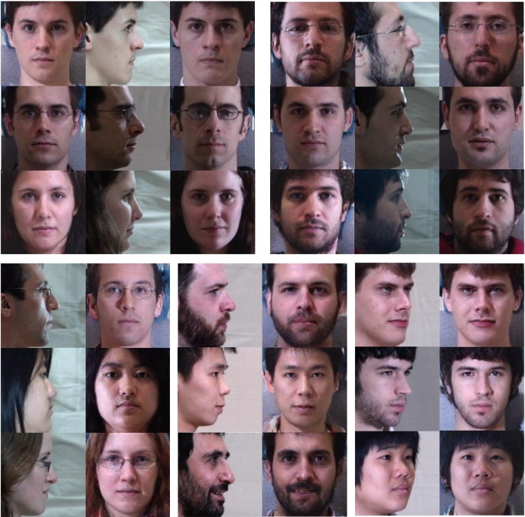

图1. TP-GAN的正面视图合成。上半部分显示$90^\circ$专业图像（中间）及其相应的合成和地面真实正面。我们邀请读者猜测哪一方是我们的综合结果（请参阅第1节的答案）。下半部分分别显示了$90^\circ$，$75^\circ$和$45^\circ$的合成正面视图。

对于第二类，早期对正面视图合成的努力通常利用3D几何变换通过首先将2D图像与一般[12]或身份特定[32, 44] 3D模型对齐来渲染正面视图。这些方法擅长对小姿势面进行归一化，但是由于严重的纹理损失，它们在大面部姿势下的性能会降低。最近，提出了基于深度学习的方法以数据驱动的方式恢复正面。例如，朱等人。 [46]建议在学习估计正面视图的同时解开身份和姿势表征。尽管它们的结果令人鼓舞，但合成图像有时缺乏细节，并且在大的姿势下往往模糊，因此它们仅使用中间特征进行面部识别。合成图像仍然不足以执行其他面部分析任务，例如取证和属性估计。

此外，从优化的角度来看，从未完全观察到的概率中恢复正面视图是一个不适定或欠定义的问题，并且如果没有考虑先验知识或约束，则存在多个解决该问题的方案。因此，恢复结果的质量很大程度上依赖于训练过程中利用的先验或约束。以前的工作[17,17,45,46]通常采用成对监督，很少在训练过程中引入约束，因此它们往往会产生模糊的结果。

当人类尝试进行视图合成过程时，我们首先根据我们的先验知识和观察到的概率来推断正面的全局结构（或草图）。然后我们的注意力转移到所有面部细节将被填充的当地区域。受此过程的启发，我们提出了一种具有两个路径（TP-GAN）的深层架构，用于正面视图合成。这两种途径分别关注全局结构的推断和局部纹理的转换。然后将它们相应的特征图融合，以进一步生成最终合成的过程。我们还通过将生成的对抗性网络（GAN）[9]纳入正面分布的先验知识，使恢复过程受到很好的约束。 GAN在2D数据分布建模方面的出色能力已经显着提升了许多不适定的低水平视觉问题，如超分辨[19]和修复[24]。特别是，从面部的对称结构中汲取灵感，提出了对称性损失来填充遮挡部分。此外，为了忠实地保留个体最突出的面部结构，除了像素方式的L1损失之外，我们在紧凑的特征空间中采用感知损失[16]。结合身份保留损失对于忠实的综合至关重要，并极大地提高了其应用于面部分析任务的潜力。我们在图1的上半部分（每个元组的左侧）显示了由TP-GAN生成的一些样本。

我们工作的主要贡献在于三个方面：1）我们提出了一种类似人类的全局和局部感知GAN架构，用于从单个图像进行正面视图合成，即使在非常大的姿势下也可以合成照片级真实感和身份保持正面视图图像。 2）我们结合来自数据分布（对抗性训练）的先验知识和面部的领域知识（对称性和身份保持损失）来精确地恢复将3D对象投影到2D图像空间中所固有的丢失信息。 3）我们展示了“通过生成识别”框架的可能性，并且在大的姿势下超越了最先进的识别结果。虽然已经提出了一些面部合成的深度学习方法，但我们的方法是首次尝试对合成面部的识别任务有效。

## 2. 相关工作

### 2.1 正面视图合成

正面视图合成，或称为面部归一化，由于其不适合的性质，是一项具有挑战性的任务。传统方法通过2D / 3D局部纹理变形[12,44]或统计建模[27]解决了这个问题。例如，哈斯纳等人。 [12]采用平均3D模型进行面部归一化。在[27]中提出了一种联合正面视图合成和地标定位方法，其具有约束低秩最小化模型。最近，研究人员采用卷积神经网络（CNN）进行联合表示学习和视图合成[17,41,45,46]。具体而言，Yim等人。 [41]提出了一种多任务CNN来预测保持旋转图像的身份。朱等人。 [45,46]开发新颖的架构和学习目标，以在估计正面视图的同时解开身份和姿势表示。里德等人。 [25]建议使用玻尔兹曼机器模拟变异因子，并通过姿势流形遍历生成旋转图像。虽然如果合成图像可以直接用于面部分析任务更方便，但是大多数先前的方法主要采用中间特征进行面部识别，因为它们不能忠实地产生身份保持合成。

### 2.2 生成对抗网络（GAN）

作为深度生成模型研究中最显着的改进之一[18,26]，GAN [9]引起了深度学习和计算机视觉社会的极大关注。 min-max双人游戏提供了一种简单而有效的方法来估计目标分布并生成新的图像样本[6]。随着它用于分布建模的功率，GAN可以鼓励所生成的图像朝向真实图像流形移动，从而生成具有合理的高频细节的真实感图像。最近，修改过的GAN架构，尤其是条件GAN [21]已成功应用于视觉任务，如图像修复[24]，超分辨率[19]，样式转换[20]，面部属性操作[29]甚至数据增强分类模型的增强[30,43]。 GAN的这些成功应用激励我们开发基于GAN的正面视图合成方法。

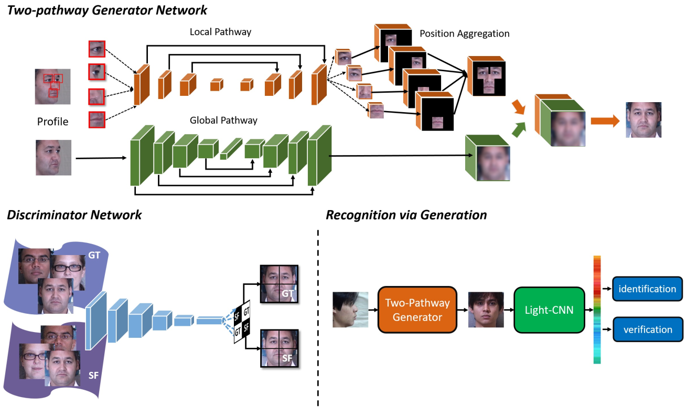


图2. TP-GAN的一般框架。 Generator包含两个路径，每个路径处理全局或局部变换。鉴别器区分合成正面（SF）视图和地面实况（GT）正面视图。详细的网络架构可以在补充材料中找到。

## 3. 方法


正面视图合成的目的是从不同姿势下的面部图像（即，轮廓图像$I^P$）恢复照片写实和身份保持正面视图图像$I^F$.为了训练这样的网络，在训练阶段期间需要来自多个身份$y$的相应$\{I^F, I^P\}$对。输入$I^P$和输出$I^F$都来自具有$C$颜色通道的尺寸为$W\times H\times C$的像素空间。

我们的目标是学习一种综合功能，可以从任何给定的专业图像中推断出相应的正面视图。具体而言，我们使用由$G_{\theta_G}$参数化的双路CNN $G_{\theta_G}$对合成函数进行建模。每个路径包含编码器和解码器，表示为$\{G_{\theta_E^g}, G_{\theta_D^g}\}$和$\{G_{\theta_E^l}, G_{\theta_D^l}\}$，其中$g$和$l$分别代表全局结构路径和局部纹理路径。在全局路径中，作为$G_{\theta_G}$输出的瓶颈层通常用于具有交叉熵损失$L_{cross\_entropy}$熵的分类任务[40]。

网络参数$G_{\theta_G}$由mini优化模拟特定设计的合成损失$L_{syn}$和上述$L_{cross\_entropy}$熵。对于具有$\{I_n^F, I_n^P\}$的$N$个训练对的训练集，优化问题可以表述如下：
$$
\hat\theta_G=\frac1N\underset{\theta G}{\arg\min}\sum_{n=1}^N\{L_{syn}(G_{\theta_G}(I_n^P), I_n^F)\}
$$
其中$\alpha$是加权参数，$L_{syn}$被定义为共同约束图像以驻留在所需流形中的若干损失的加权和。我们将把所有单个损失函数的详细描述推迟到3.2节。

### 3.1 网络架构

#### 3.1.1 双路发生器

TP-GAN的一般体系结构如图2所示。与通常用单一网络模拟综合函数的先前方法[17, 1, 4, 4, 46]不同，我们提出的生成器$G_{\theta_G}$有两个路径，一个全局网络$G_{\theta_g}$处理全局结构和四个地标定位的补丁网络$G_{\theta_i^l}, i\in\{0, 1, 2, 3\}$，其遵循四个面部地标周围的局部纹理。

我们不是第一个采用两种途径建模策略的人。实际上，对于2D / 3D局部纹理变形[12, 44]方法来说，这是一个非常流行的例程。与人类认知过程类似，它们通常将面部的标准化分为两个步骤，第一步是将面部全局与2D或3D模型对齐，第二步是将局部纹理扭曲或渲染到全局结构。此外，穆罕默德等人。 [22]将全局参数模型与局部非参数模型相结合，用于新颖的人脸合成。

从配置图像$I^P$合成正面$I^F$是高度非线性变换。由于过滤器在人脸图像的所有空间位置共享，我们认为仅使用全球网络无法学习适合旋转脸部和精确恢复局部细节的过滤器。因此，我们将传统方法中两种途径结构的成功转化为基于深度学习的框架，并引入用于正面视图合成的人类两路径生成器。

如图2所示，$G_{\theta_g}$由下采样编码器$G_{\theta_g}$和上采样解码器$G_{\theta_g}$组成，引入额外跳过层用于多尺度特征融合。中间的瓶颈层输出256维度特征向量$v_{id}$，其用于身份分类以允许身份保持合成。在这个瓶颈层，如[33]，我们将100维高斯随机噪声连接到$v_{id}$，以模拟姿势和身份以外的变化。

#### 3.1.2 地标定位补丁网络

位于贴片网络$G_{\theta^l}$的地标的四个输入贴片是从四个面部标志中心裁剪的，即左眼中心，右眼中心，鼻尖和嘴岑，学习单独的一组过滤器每个$G_{\theta_i^l}, i\in\{0, 1, 2, 3\}$用于将中心裁剪的贴片旋转到其相应的正面视图（旋转后，面部标志仍位于中心）。位于地标的补丁网络的架构也基于编码器 - 解码器结构，但它没有完全连接的瓶颈层。为了有效地整合来自全球和本地路径的信息，我们采用直观的方法进行特征地图融合。如图2所示，我们首先将四个局部路径的输出特征张量（多个特征图）融合到一个与全局特征张量具有相同空间分辨率的单个特征张量。具体而言，我们将每个特征张量放在“模板界标位置”，然后引入最大化融合策略以减少重叠区域上的拼接伪影。然后，我们简单地连接每个路径的特征张量以产生融合特征张量，然后将其馈送到连续的卷积层以生成最终的合成输出。

#### 3.1.3对抗性网络

为了将正面分布的先验知识结合到训练过程中，我们进一步引入鉴别器$D_{\theta_D}$以根据Goodfellow等人的工作来区分真实正面图像I F与合成正面图像$G_{\theta_G}(I^P)$。 [9]。我们训练$D_{\theta_D}$和$G_{\theta_G}$以交替方式优化以下最小 - 最大问题：

$$
\min_{\theta_G}\max_{\theta_D}\mathbb E_{I^F\sim P(I^F)}\log D_{\theta_D}(I^F)+\mathbb E_{I^P\sim P(I^P)}\log(1-D_{\theta_D}(G_{\theta_G}(I^P)))\tag2
$$
解决这个最小 - 最大问题将持续推动发生器的输出以匹配训练正面的目标分布，因此它促使合成图像驻留在正面的多个面中，从而导致具有吸引人的高频细节的照片级真实合成。如在[30]中，我们的$D_{\theta_D}$输出2×2概率图而不是一个标量值。现在每个概率值对应于某个区域而不是整个面部，并且$D_{\theta_D}$可以特定地集中在每个语义区域上。

### 3.2 合成损失函数

我们工作中使用的综合损失函数是四个单独损失函数的加权和，我们将在以下部分给出详细描述。

#### 3.2.1 像素损失

我们在多个位置采用像素方式L1丢失，以促进多尺度图像内容的一致性：

$$
L_{pixel}=\frac1{W\times H}\sum_{x=1}^W\sum_{y=1}^H|I_{x,y}^{pred}-I_{x,y}^{gt}|\tag3
$$
具体而言，像素明显的损失是在全球输出，位于地标的贴片网络及其最终融合输出处测量的。为了便于深入监督，我们还对$G_{\theta_g}$的多尺度输出添加约束。虽然这种损失会导致合成结果过于平滑，但它仍然是加速优化和卓越性能的重要组成部分。

#### 3.2.2对称损失

对称性是人脸的固有特征。利用该领域知识作为先验并对合成图像施加对称约束可以有效地减轻自遮挡问题，从而大大提高大型姿势情况的性能。具体而言，我们在两个空间中定义对称性损失，即原始像素空间和拉普拉斯图像空间，其对于光照变化是鲁棒的。面部图像的对称性损失采用以下形式：

$$
L_{sym}=\frac1{W/2\times H}\sum_{x=1}^{W/2}\sum_{y=1}^H|I_{x,y}^{pred}-I_{W-(x-1), y}^{pred}|\tag4
$$
图3.在45°（前两行）和30°（最后一行）的姿势下与最先进的合成方法进行比较。

为简单起见，我们选择性地输入输入，使得被遮挡的部分都在右侧。此外，只有$I^{pred}$的遮挡部分（右侧）才能获得对称性损失，即我们明确地将右侧拉近左侧。 $L_{sym}$的贡献是双重的，通过鼓励对称结构产生逼真的图像，并通过提供额外的反向传播梯度来加速TP-GAN的收敛，从而减轻极端姿势的自我遮挡。然而，由于光照变化或固有纹理差异，像素值在大多数时间内不是严格对称的。幸运的是，局部区域内的像素差异是一致的，并且沿着所有方向的点的梯度在很大程度上保留在不同的照明下。因此，拉普拉斯空间对于光照变化更稳健并且更能指示面部结构。

#### 3.2.3 对抗性损失

用于从合成正面图像$G_{\theta_G}(I^P)$区分真实正面图像$I^F$的损失计算如下：

$$
L_{adv}=\frac1N\sum_{n=1}^N-\log D_{\theta_D}(G_{\theta_G}(I_n^P))\tag5
$$
$L_{adv}$用作监督以推动合成图像驻留在正面视图图像的流形中。它可以防止模糊效果并产生视觉上令人愉悦的结果。

#### 3.2.4 身份保护损失

在合成正面视图图像时保留身份是开发“通过生成识别”框架中最关键的部分。在这项工作中，我们利用最初提出的感知损失[16]来保持感知相似性，以帮助我们的模型获得身份保持能力。具体而言，我们根据Light CNN最后两层的激活来定义身份保持损失[38]：
$$
L_{ip}=\sum_{i=1}^2\frac1{W_i\times H_i}\sum_{x=1}^{W_i}\sum_{y=1}^{H_i}|F(I^P)_{x,y}^i-F(G(I^{pred}))_{x,y}^i|\tag6
$$
其中$W_i,H_i$表示最后一个第$i$层的空间维度。身份保持损失强制预测与紧凑深度特征空间中的地面实况具有小的距离。由于Light CNN经过预先训练以对成千上万的身份进行分类，因此它可以捕获身份歧视的最突出的特征或面部结构。因此，利用这种损失来强制执行保持正面视图合成的身份是完全可行的。与$L_{adv}$一起使用时，$L_{ip}$具有更好的性能。单独使用$L_{ip}$会使结果容易出现恼人的伪影，因为搜索局部最小的$L_{ip}$可能会经过一条位于自然面部图像之外的路径。同时使用$L_{adv}$和$L_{ip}$可确保搜索位于该流形中并产生逼真的图像。

#### 3.2.5总体目标函数

最终的综合损失函数是上面定义的所有损失的加权和：

$$
L_{syn}=L_{pixel}+\lambda_1L_{sym}+\lambda_2L_{adv}+\lambda_3L_{ip}+\lambda_4L_{tv\tag7}
$$
我们还对合成结果施加了总变差正则化$L_{tv}$ [16]，以减少尖峰伪像。

## 4. 实验

除了合成自然的正面视图图像外，所提出的TP-GAN还旨在生成身份保持图像，以便使用现成的深层特征进行精确的面部分析。因此，在本节中，我们证明了我们的模型在定性合成结果和定量识别结果中的优点。 在第4.1，4.2，6.3节展示了最终深度特征表示的可视化，以说明TP-GAN的有效性。最后，在第4.4节，我们进行详细的算法评估，以证明所提出的双路架构和综合损失函数的优点。实施细节我们在所有实验中都使用尺寸为$128\times128\times3$的彩色图像进行输入

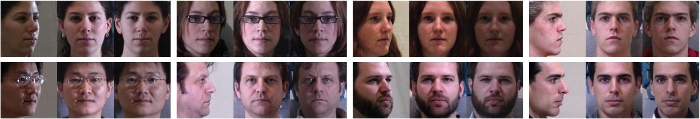

图4. TP-GAN在不同姿势下的合成结果。从左到右，姿势分别为90°，75°，60°，45°，30°和15°。地面实况正面图像在最后一列提供。

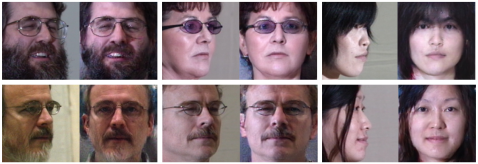

图5.具有挑战性的情况。面部属性，例如胡须，眼镜由TP-GAN保存。被遮挡的额头和脸颊被收回。

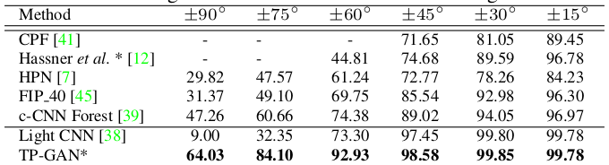

表1.设置1下的视图和照明的Rank-1识别率（％）。对于所有剩余的表，只有标有*的方法遵循“通过生成识别”程序，而其他表格利用中间特征进行人脸识别。


$I^P$和预测$I^{pred}=G_{\theta_G}(I^P)$。我们的方法在MultiPIE [10]上进行了评估，这是一个拥有750,000多个图像的大型数据集，用于在姿势，光照和表情变化下进行人脸识别。功能提取网络Light CNN在MS-Celeb-1M [11]上进行了训练，并在MultiPIE的原始图像上进行了调整。我们的网络是用Tensorflow [1]实现的。 TP-GAN的培训持续一天，批量为$10$，学习率为$10^{-4}$。在我们所有的实验中，我们根据经验设定$\alpha=10^{-3},\lambda_1=0.3, \lambda_2=10^{-3}, \lambda_3=3\times10^{-3}, \lambda_4=10^{-4}$。

### 4.1 面部合成

以前关于正面视图合成的大部分工作都致力于在$\pm60^\circ$的姿势范围内解决该问题。因为通常认为姿势大于$60^\circ$，很难忠实地恢复正面视图图像。但是，我们将展示给定足够的训练数据和适当的架构和损失设计，实际上可以从非常大的姿势恢复逼真的正面视图。图4显示了TP-GAN从任何姿势中恢复令人信服的保持身份的正面的能力图3示出了与现有技术的脸部正面化方法的比较。请注意，大多数TP-GAN，竞争对手都无法处理大于$45^\circ$的姿势，因此，我们只在$30^\circ$和$45^\circ$下报告他们的结果。

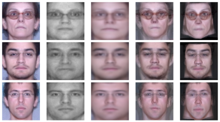

图6.每个标识的六个图像（$\pm45^\circ$内）的平均面。

与竞争方法相比，TP-GAN在产生照片般逼真的合成的同时提供了良好的身份保持质量。得益于Ladv和Lip的先前知识的数据驱动建模，不仅整个面部结构而且闭塞的耳朵，脸颊和前额可以以一致的方式产生幻觉。此外，它还完美地保留了原始图像中观察到的面部属性，例如，眼镜和发型，如图5所示。

为了进一步证明多个姿势的合成的稳定几何形状，我们在图6中显示了来自不同姿势的合成面的平均图像。来自TP-GAN的平均面保留更多纹理细节并包含更少的模糊效果，在多个合成中显示稳定的几何形状。请注意，我们的方法不依赖于任何3D知识进行几何形状估计，推理是通过纯粹的数据驱动学习来完成的。

作为我们模型的演示，我们使用LFW [14]数据集中的图像来测试仅在Multi-PIE上训练的TP-GAN模型。如图7所示，虽然得到的色调与来自Multi-PIE的图像相似，但TP-GAN可以忠实地合成具有Multi-PIE细节的正面视图图像和LFW数据集中面部的更好的全局形状。最先进的方法，如[12,44]。


表2.设置2下的视图，照明和会话的Rank-1识别率（％）。


图7. LFW数据集的综合结果。注意TP-GAN是在Mulit-PIE上训练的。

### 4.2 身份保护财产

**人脸识别** 为了定量地展示我们方法的身份保持能力，我们使用两种不同的设置在MultiPIE上进行人脸识别。通过首先用Light-CNN [38]提取深度特征进行实验，然后将Rank-1识别精度与余弦距离度量进行比较。在配置图像I P上的结果作为我们的基线，并在所有表格中用符号Light-CNN标记。应该注意的是，尽管已经提出了许多用于正面视图合成的深度学习方法，但是它们的合成图像都没有被证明对于识别任务是有效的。在最近一项关于面部幻觉的研究[37]中，作者表明，直接使用CNN合成的高分辨率人脸图像进行识别肯定会使性能退化，而不是改善性能。因此，验证我们的综合结果是否可以提高识别性能（“通过生成识别”程序是否有效）具有重要意义。

在设置1中，我们遵循[39]中的协议，并且仅使用来自会话1的图像。我们包括20个照明下的中性表达和$\pm90^\circ$内11个姿势的图像。每个测试对象使用一个具有正面视图和照明的图库图像。训练集和测试集之间没有重叠。表1显示了我们的识别性能以及与现有技术的比较。 TP-GAN始终在所有角度都达到最佳性能，角度越大，改进越大。与c-CNN Forest [39]（三个模型的集合）相比，我们在大型姿势案例中实现了约20％的性能提升。

在设置2中，我们遵循[41]中的协议，其中使用来自所有四个会话的神经表达图像。从每个测试标识的第一次出现中选择一个图库图像。 MultiPIE的所有合成图像本文中的测试标识来自设置2下的测试标识。结果如表2所示。请注意，所有基于CNN的比较方法都是通过学习中间特征实现最佳性能，而我们直接使用“通过生成识别”后的合成图像“程序。

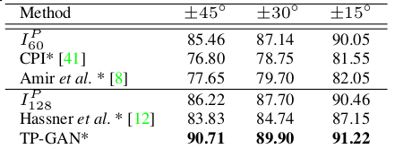

表3.不同视图和照明的性别分类准确度（％）。

**性别分类** 为了进一步证明我们的合成图像在其他面部分析任务中的潜力，我们进行了性别分类的实验。本部分中的所有比较方法也遵循“通过生成识别”程序，其中我们直接使用它们的综合结果进行性别分类。用于性别分类的CNN与编码器$G_{\theta_g}$具有相同的结构，并且在UMD [3]数据集的批处理1上训练。

我们在表3中报告了Multi-PIE（设置-1）的测试性能。为了公平比较，我们分别以两种分辨率$128\times128(I^P_{128})$和$128\times128(I^P_{60})$呈现未旋转原始图像的结果。由于标准化视图，TP-GAN的合成实现了比原始图像更好的分类精度。所有其他比较模型的性能都比基线差，这并不奇怪，因为它们的架构不是针对性别分类任务而设计的。在[37]中观察到类似的现象，其中合成的高分辨率面部图像严重地使识别性能退化而不是改善它。这表明在操纵像素空间中的图像时丢失$I^P$的突出面部特征的高风险。

### 4.3 特征可视化

我们使用t-SNE [34]来显示二维空间上的256维深度特征。图8的左侧示出了原始配置图像的深特征空间。很明显，具有大姿势（特别是90°）的图像在Light-CNN跨越的深度特征空间中是不可分离的。它揭示了即使LightCNN训练有数百万张图像，它仍然无法道具正确处理大型姿势人脸识别问题。在右侧，使用我们的TP-GAN进行正面视图合成后，生成的正面视图图像可以根据其身份轻松分类到不同的组中。

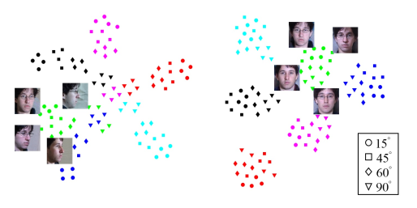

图8.配置文件（左）和平面视图合成图像（右）的特征空间。每种颜色代表不同的身份。每个形状代表一个视图。标记一个身份的图像。

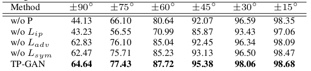

表4.模型比较：设置2下的Rank-1识别率（％）。

### 4.4 算法分析

在本节中，我们将介绍不同的体系结构和损失函数组合，以深入了解它们在正面视图合成中的各自作用。报告定性可视化结果和定量识别结果以进行全面比较。

我们比较了本节中TP-GAN的四种变体，一种用于比较体系结构，另一种用于比较目标函数。具体而言，我们训练没有局部路径的网络（表示为P）作为第一个变体。关于损失函数，我们保持双路径结构完整并且在每种情况下去除三个损失中的一个，即$L_{ip}$，$L_{adv}$和$L_{sym}$。

表4中报告了详细的识别性能。双路径架构和身份保持损失对于提高识别性能贡献最大，尤其是在大型姿势案例中。虽然不那么明显，但对称性损失和对抗性损失都有助于提高识别性能。图9说明了这些变体的感知性能。正如预期的那样，没有身份保留损失或局部路径的推断结果严重偏离了真实的外观。没有对抗性损失的合成趋于非常模糊，而没有对称性损失的结果有时会显示出不自然的不对称效应。

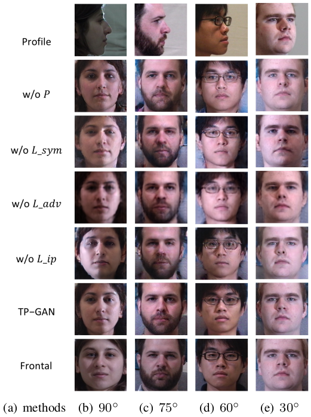

图9.模型比较：TP-GAN及其变体的合成结果。

## 5. 结论

在本文中，我们从单个图像中提出了用于正面视图合成的全局和局部感知GAN框架。该框架包含两个独立的路径，分别建模全局结构的平面外旋转和局部纹理的非线性变换。为了使不适定合成问题得到很好的约束，我们在训练过程中进一步引入了对抗性损失，对称性损失和身份保持损失。对抗性损失可以忠实地发现和引导综合以驻留在正面的数据分布中。在大型姿势情况下，对称性损失可以在减轻自遮挡效应之前明确地利用对称性。此外，身份保护损失被纳入我们的框架，因此合成结果不仅在视觉上吸引人，而且还容易适用于准确的面部识别。实验结果表明，我们的方法不仅具有引人注目的感知结果，而且在大型姿势人脸识别方面也优于最先进的结果。

## 6.补充材料

### 6.1 详细的网络架构

全局路径$G_{\theta_g}$的详细结构在表5和表6中提供.$G_{\theta_g}$的每个卷积层之后是一个残差块[13]。特别地，层$conv4$之后是四个块。该通过从$fc1$的两个分割半部中选择最大元素来获得层$fc2(vid)$的输出。

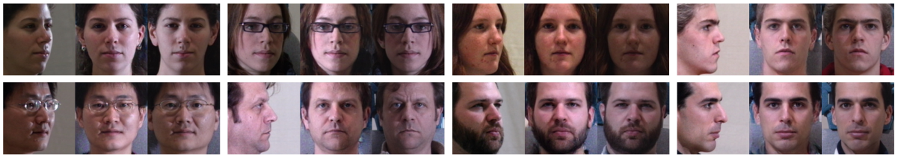

图10.我们的合成图像在某些情况下表现出适度更好的曝光。每个元组由三个图像组成，左边的输入$I^P$，中间的合成，右边的地面真实正面$I^{gt}$。每个$I^P$及其对应的$I^{gt}$在相同方向的闪光下拍摄。

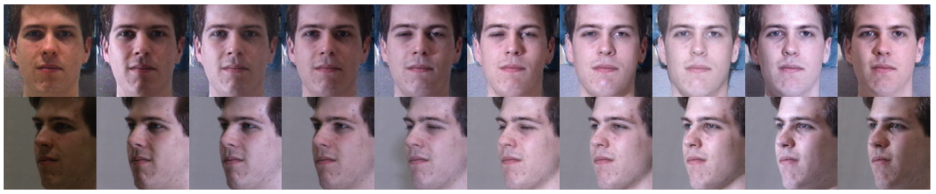

图11.各种照明下的合成结果。第一行是合成图像，第二行是输入。请参阅补充材料以获得更多结果。

全局路径$G_{\theta_g}$的解码器包含两部分。第一部分是一个简单的反卷积堆栈，用于对特征向量$v_{id}$和随机噪声向量$z$的串联进行上采样。第二部分是重建的主要反卷积堆栈。每个层将其前一层的输出作为常规输入，为了便于阅读，在表中省略了该输出。任何额外的输入都在$Input$列中指定。特别是，$feat8$和$deconv0$层具有完整的输入指定。这些额外的输入实例化跳过层和两个路径之间的桥梁。来自局部路径的融合特征张量在表6中表示为局部。来自局部途径的融合特征张量在表6中表示为局部素.张量$local$是四个$G_{\theta_D^l}$层$conv4$（表7）的输出的融合。为了混合各种输入的信息，所有额外的输入在串联进行反卷积之前通过一个或两个残余块。轮廓图$I^P$被调整大小到相应的分辨率并提供对$G_{\theta_D^g}$的原始纹理的快捷访问。

表7示出了局部路径$G_{\theta_D^l}$和$G_{\theta_D^l }$的结构。本地路径分别包含三个下采样和上采样过程。 $w$和$h$表示裁剪补丁的宽度和高度。对于两只眼睛，我们设置了40；对于鼻子的贴片，我们设置为40和32；对于它们的补丁，我们分别设置了48和32。我们使用整流线性单元（ReLU）[23]作为非线性激活，并采用批量归一化[15]作为最后一层。 在$G_{\theta_E^g}$和$G_{\theta_E^l}$中，leaky ReLU被采用。

**讨论：**我们的模型很简单，同时在合成法师的照片写实性方面实现了更好的表现。伊梅特[41]和朱特尔。 [45]使用局部连通的卷积层进行特征提取和完全连接的层进行合成。在大多数情况下，我们使用权重分享协议。我们的模型在很大程度上减少了参数数量，并避免了在合成期间生成每个像素的昂贵计算。伊梅特[41]和阿米雷特。 [8]增加第二个重建分支或重新细化网络。我们早期的监控解码器实现了高分辨率图像的端到端生成。

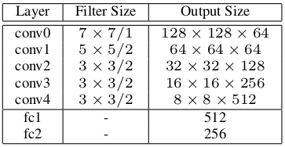

表5.全局路径$G_{\theta_g}$的编码器的结构

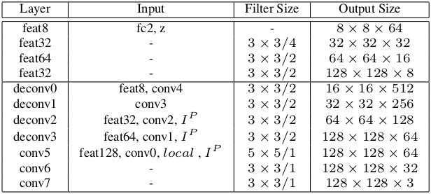

表6.全局路径的解码器的结构在输入列中的$G_{\theta_g}$转换参考表5中的那些。

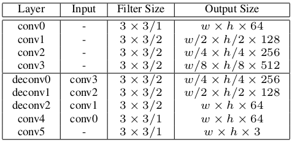

表7.输入栏中的局部路径$G_{\theta_D^l}\&G_{\theta_D^l}$的结构参考同一表中的那些。

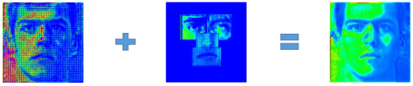

图12.从激活图的角度说明的合成过程。上采样特征图$C_g$与局部路径特征图$C_l$组合以产生具有详细纹理的特征图。

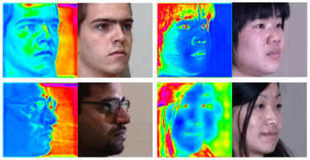

图13.自动检测某些语义区域。一些跳过图层的激活图对某些语义区域敏感。用于检测非面部区域的一个显示在左侧，另一个用于检测头发区域显示在右侧。注意眼镜和边缘周围细腻复杂的区域边界。

bers在很大程度上避免了在合成期间生成每个像素的昂贵计算。 Yim等人[41]和Amir等人[8]增加第二个重建分支或改进网络。我们早期的监控解码器实现了高分辨率图像的端到端生成。

### 6.2 其他综合结果

I pred的附加合成图像显示在图10和图11中。在极端照明条件下，$I^{pred}$的曝光与其输入$I^P$或其地面实况正面$I^{gt}$的曝光一致或稍微好一些。图11展示了TP-GAN对光照变化的稳健性。尽管极端的照明变化，但是肤色，全局结构和局部细节在整个照明中是一致的。我们的方法可以自动调整$I^P$的曝光和白平衡。

此外，我们使用最先进的面部对齐方法[42]为极端姿势下的TP-GAN提供四个标志。结果仅比本文表2中报告的略差。具体而言，我们的Rank-1识别率达到$87.63(\pm60^\circ)$，$76.69(\pm75^\circ)$，$62.43(\pm90^\circ)$。

### 6.3 激活地图可视化

在这一部分中，我们可视化中间特征图，以获得对双路径网络处理机制的一些见解。图12说明了在最终输出之前的全局和局部信息的融合。 $C_g$包含全局路径的上采样输出，$C_1$指的是从四个本地路径融合的特征图。它们的信息通过以下卷积层连接并进一步集成。

我们还发现TP-GAN可以自动检测某些语义区域。图13示出了某些跳过层对诸如非脸区域和头发区域的区域具有高激活。网络在没有监督的情况下学习检测。直观地，将输入图像划分成不同的语义区域简化了正面的以下组成或合成。

## 声明

这项工作部分由国家自然科学基金（批准号61622310,61473289）和国家重点发展计划（批准号2016YFB1001001）资助。我们感谢吴翔的有益讨论。

## 参考文献

pass

## 附录

```BibTex
@article{Huang2017Beyond,
  title={Beyond Face Rotation: Global and Local Perception GAN for Photorealistic and Identity Preserving Frontal View Synthesis},
  author={Huang, Rui and Zhang, Shu and Li, Tianyu and He, Ran},
  pages={2458-2467},
  year={2017},
}
```

